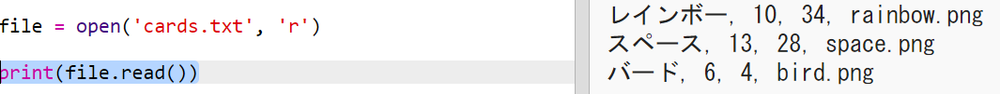

## ファイルからロボットデータを読み込む

ファイルから情報を読み取ることはしばしば有用です。 その後、コードを変更することなく、ファイル内のデータを変更することができます。

+ この小物を開きます： <a href="http://jumpto.cc/trumps-go" target="_blank">jumpto.cc/trumps-go</a>。

+ あなたのスタータープロジェクトには、ロボットに関するデータを含む `cards.txt` ファイルが含まれています。
    
    `cards.txt` をクリックしてデータを表示します：
    
    
    
    各行にはロボットに関するデータがあります。 データ項目はコンマで区切られています。
    
    各行には次の情報が含まれています。
    
    名前、インテリジェンスレーティング、バッテリーの持続時間、画像ファイル名

+ ファイルからデータを読み込み、使用できるようにしましょう。
    
    最初のステップは、あなたのスクリプトに `cards.txt` ファイルを開くことです：
    
    

+ これでファイルからデータを読み取ることができます：
    
    

+ 終了したら、ファイルを閉じる必要があります：
    
    

+ それは私たちにファイルを1つの文字列として与え、個々のデータに分割する必要があります。
    
    まず、ファイルを行のリストに分割することができます。
    
    
    
    出力を注意深く見てください。 リストには3つの項目があり、それぞれがファイルの行です。

+ 今度は、それらの行を一度に1つずつループすることができます
    
    

+ 行を印刷する代わりに、変数を変数に読み込みます。
    
    

+ このデータを後で使用して、特定のロボットの値を参照できるようにする必要があります。 ロボットの名前を辞書のキーとして使用しましょう。
    
    `台のロボットを追加` 辞書：
    
    

+ 次に、各ロボットのロボット辞書にエントリを追加しましょう。
    
    名前はキーで、値はそのロボットのデータのリストです。
    
    強調表示されたコードを追加：
    
    
    
    あなたのスクリプトをテストしたときに、 `プリントロボット` 取り除くことができます。