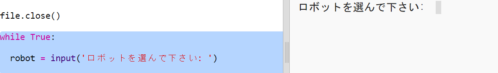
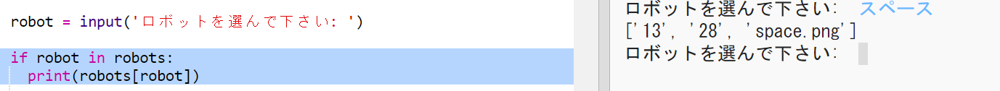
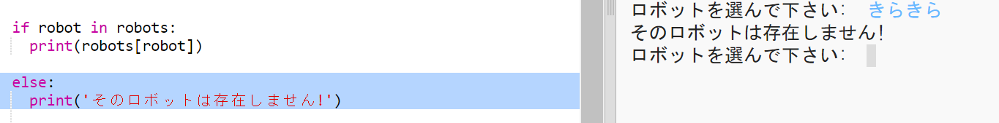
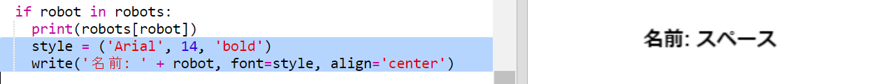
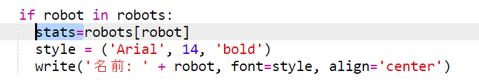
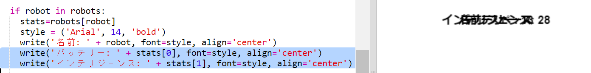
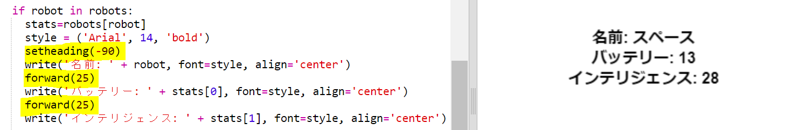
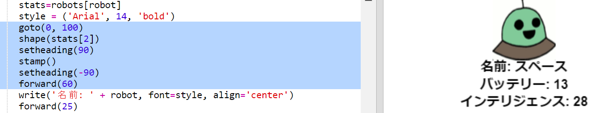
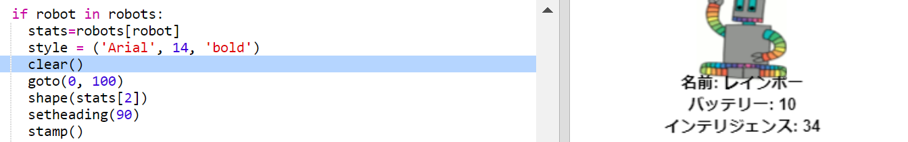

## データを表示する

では、ロボットのデータをもっと面白い方法で表示できるようにしましょう。

ロボットトランプカードに画像とデータを使って知性と有用性を表示しましょう。

このステップを完了すると、次のようにロボットを表示できるようになります。

+ どのロボットを見たいのかユーザーに聞いてみましょう：
    
    

+ ロボットが辞書にある場合は、そのデータを検索します。
    
    
    
    ロボット名を入力してコードをテストします。

+ ロボットが存在しない場合はエラーを返します。
    
    
    
    辞書にないロボット名を入力して、コードをテストします。

+ 次に、Pythonタートルを使用してロボットデータを表示します。
    
    スクリプトの一番上にタートルライブラリをインポートして、スクリーンとタートルを設定します。
    
    

+ 次に、タートルにロボットの名前を印刷させるコードを追加します。
    
    

+ テキストに満足するまで `style` 変数を変更してみてください。
    
    `Arial`の代わりに、`Courier`、`Times`または`Verdana`を試すことができます。
    
    `14` を別の番号に変更して、フォントのサイズを変更します。
    
    `bold`を`normal`または`italic`に変更できます。

+ ロボットの統計情報のリストを印刷するのではなく変数に格納する：
    
    

+ これで、リストの項目としてロボットの統計にアクセスできます。
    
    + `stats[0]` はインテリジェンスです
    + `stats[1]` はバッテリーです
    + `stats[2]` は画像ファイル名です
    
    インテリジェンスとバッテリーの統計を表示するコードを追加します。
    
    

+ まあ！ 統計はすべて互いに重なり合っています。 タートルを動かすには、コードを追加する必要があります。
    
    

+ 最後にロボットの画像を追加して、表示を完成させましょう。
    
    `cards.txt`からデータを読み取ったあと、画像を登録するの行を追加する必要があります ：
    
    

+ 位置を指定して画像をスタンプするコードを追加します：
    
    

+ あるロボットを入力してから別のロボットを入力してコードをテストすると、それらが互いに重なり合って表示されることがわかります。
    
    ロボットを表示する前に画面をクリアする必要があります：
    
    