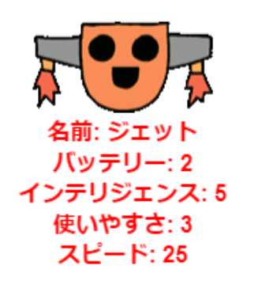

--- challenge ---

## 課題：ロボットにさらに統計情報を追加する

ロボットに追加する統計をもっと考えられますか？ 「スピード」や「有用性」を追加したり、独自のアイデアを思いつくことができます。

次のことを行う必要があります。

+ 新しいカテゴリごとにファイルにデータを追加する 
+ データを読み取るコードに新しいカテゴリを追加する
+ トランプカードを表示するときに新しいカテゴリを書き出す

色を追加して、ロボットの統計情報を独自の色で表示することもできます。

ヒント: 書き込む前に`color('red')`を使うと、タートルのテキストを赤に変更できます。

例：

--- /challenge ---