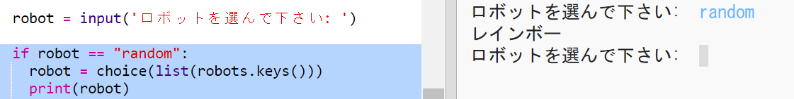

## ランダムなロボットを表示する

ロボット名の代わりにランダムを入力するとランダムなロボットを得るようにコードを追加しましょう。

+ まずランダムモジュールからchoice関数をインポートする必要があります：
    
    

+ `選択肢` を使用して、ロボット辞書からのキーのリストからランダムなロボット名を選択することができます。
    
    

+ Pythonの3では、あなたが使用する必要が `リスト` 結果オンにする `キー` リストに。
    
    ヒント：括弧を注意深くチェックしてください！