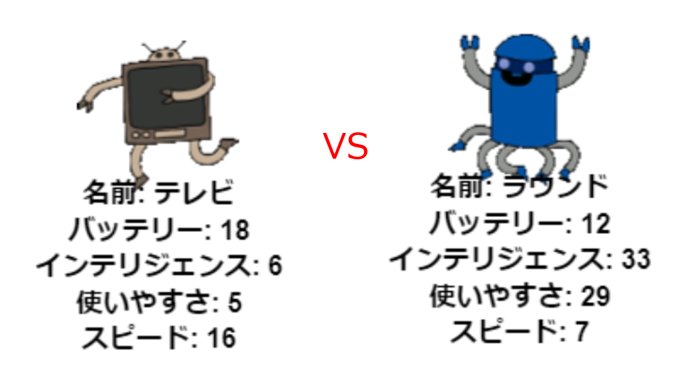

--- challenge ---

## 課題：友人とロボットトランプをプレイしよう

プロジェクトを友人と共有し、ロボットトランプをプレイしましょう。 どちらも同じプロジェクトを使用しているため、公平です。 プレイヤー1はランダムにロボットを選び、次にカテゴリを選択します。 次に、プレーヤー2がランダムにロボットを選び、選択したカテゴリのスコアがどちらが高いかを確認し、交代します。

両社が同じデッキのカードでプレイすると、ゲームは最もうまく行きます。 同じデッキを使うことができるように、友人とtrinketプロジェクトへのリンクを共有してください。

--- /challenge ---

***
このプロジェクトは以下のボランティアによって翻訳されました。

Yasu Kaneko

大野 雅利

森 友里恵

ボランティアのおかげで、世界中の人々に母国語で学ぶ機会を与えることができます。翻訳を引き受けていただくことで、より多くの人々に手を差し伸べることができます。詳しくは [rpf.io/translate](https://rpf.io/translate) をご覧ください。