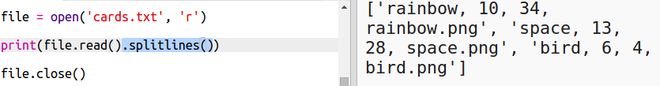

## ಫೈಲ್‌ನಿಂದ ರೋಬೋಟ್ ಡೇಟಾವನ್ನು ಓದಿ

ಫೈಲ್‌ನಿಂದ ಮಾಹಿತಿಯನ್ನು ಓದಲು ಸಾಧ್ಯ. ನಿಮ್ಮ ಕೋಡ್ ಅನ್ನು ಬದಲಾಯಿಸದೆ ನೀವು ಫೈಲ್‌ನಲ್ಲಿರುವ ಡೇಟಾವನ್ನು ಬದಲಾಯಿಸಬಹುದು.

+ ಈ trinket ತೆರೆಯಿರಿ:<a href="http://jumpto.cc/trumps-go" target="_blank">jumpto.cc/trumps-go</a>.

+ ನಿಮ್ಮ ಸ್ಟಾರ್ಟರ್ ಪ್ರಾಜೆಕ್ಟ್(starer project) `cards.txt` ಅನ್ನು ಒಳಗೊಂಡಿದೆ ಇದು ರೋಬೋಟ್‌ಗಳ ಬಗ್ಗೆ ಡೇಟಾವನ್ನು ಹೊಂದಿರುತ್ತದೆ.
    
    ಡೇಟಾವನ್ನು ನೋಡಲು `cards.txt` ಕ್ಲಿಕ್ ಮಾಡಿ:
    
    
    
    ಪ್ರತಿಯೊಂದು ಸಾಲಿನಲ್ಲಿ ರೋಬೋಟ್ ಬಗ್ಗೆ ಡೇಟಾ ಇರುತ್ತದೆ. ಡೇಟಾ ವಸ್ತುಗಳನ್ನು ಅಲ್ಪವಿರಾಮದಿಂದ(comma) ಬೇರ್ಪಡಿಸಲಾಗಿದೆ.
    
    ಪ್ರತಿಯೊಂದು ಸಾಲಿನಲ್ಲಿ ಈ ಕೆಳಗಿನ ಮಾಹಿತಿಯಿದೆ:
    
    ಹೆಸರು, ಬುದ್ಧಿವಂತಿಕೆ ರೇಟಿಂಗ್, ಬ್ಯಾಟರಿ ಎಷ್ಟು ಕಾಲ ಇರುತ್ತದೆ, ಇಮೇಜ್ ಫೈಲ್(file) ಹೆಸರು

+ ಫೈಲ್‌ನಿಂದ ಡೇಟಾವನ್ನು ಓದೋಣ ಇದರಿಂದ ನೀವು ಅದನ್ನು ಬಳಸಬಹುದು.
    
    ` cards.txt` ಅನ್ನು ತೆರೆಯುವುದು ಮೊದಲ ಹಂತವಾಗಿದೆ ನಿಮ್ಮ ಸ್ಕ್ರಿಪ್ಟ್‌ನಲ್ಲಿ(script) ಫೈಲ್ ಮಾಡಿ:
    
    

+ ಈಗ ನೀವು ಫೈಲ್‌ನಿಂದ ಡೇಟಾವನ್ನು ಓದಬಹುದು:
    
    

+ ನೀವು ಫೈಲ್ ಅನ್ನು ಪೂರ್ಣಗೊಳಿಸಿದಾಗ ನೀವು ಯಾವಾಗಲೂ ಅದನ್ನು ಮುಚ್ಚಬೇಕು:
    
    

+ ಅದು ನಮಗೆ ಫೈಲ್ ಅನ್ನು ಒಂದು ಸ್ಟ್ರಿಂಗ್ ಆಗಿ ನೀಡುತ್ತದೆ, ನಾವು ಅದನ್ನು ಸಣ್ಣ ಡೇಟಾದಂತೆ ಮಾಡಬೇಕಾಗಿದೆ.
    
    ಮೊದಲಿಗೆ, ನೀವು ಫೈಲ್ ಅನ್ನು ಸಾಲುಗಳ ಪಟ್ಟಿಯಾಗಿ ವಿಭಜಿಸಬಹುದು:
    
    
    
    ಔಟ್ಪುಟ್ ಅನ್ನು ಎಚ್ಚರಿಕೆಯಿಂದ ನೋಡಿ. ಪಟ್ಟಿಯಲ್ಲಿ ಮೂರು ಐಟಂಗಳಿವೆ, ಪ್ರತಿಯೊಂದೂ ಫೈಲ್‌ನಿಂದ ಒಂದು ಸಾಲು.

+ ಈಗ ಈ ಸಾಲುಗಳನ್ನು ಒಂದ್ ಒಂದ್ ಆಗೇ ಓದಬಹುದು
    
    

+ ಸಾಲುಗಳ ಪ್ರಿಂಟ್ ಮಾಡುವ ಬದಲು, ಅವುಗಳನ್ನು ಅಸ್ಥಿರಗಳಲ್ಲಿ ಓದಿ:
    
    

+ ನಿರ್ದಿಷ್ಟ ರೋಬೋಟ್‌ನ ಮೌಲ್ಯಗಳನ್ನು ಹುಡುಕಲು ನೀವು ಈ ಡೇಟಾವನ್ನು ಬಳಸಬೇಕಾಗುತ್ತದೆ. ರೋಬೋಟ್ ಹೆಸರನ್ನು ನಿಘಂಟಿನ(dictionary) ಕೀಲಿಯಾಗಿ ಬಳಸಲು ಅನುಮತಿಸುತ್ತದೆ.
    
    ಸೇರಿಸಿ `robots` ನಿಘಂಟು:
    
    

+ ಈಗ ನಾವು ಪ್ರತಿ ರೋಬೋಟ್‌ಗೆ ರೋಬೋಟ್ ನಿಘಂಟಿಗೆ ಪ್ರವೇಶವನ್ನು ಸೇರಿಸೋಣ.
    
    ಹೆಸರು ಕೀಲಿಯಾಗಿದೆ ಮತ್ತು ಮೌಲ್ಯವು ಆ ರೋಬೋಟ್‌ನ ಡೇಟಾದ ಪಟ್ಟಿಯಾಗಿದೆ.
    
    ಹೈಲೈಟ್(highlight) ಮಾಡಿದ ಕೋಡ್ ಸೇರಿಸಿ:
    
    
    
    ನೀವು ` print robots` ತೆಗೆದುಹಾಕಬಹುದು ನಿಮ್ಮ ಸ್ಕ್ರಿಪ್ಟ್ ಅನ್ನು ನೀವು ಪರೀಕ್ಷಿಸಿದಾಗ.