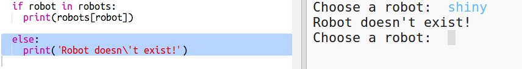

## ಡೇಟಾವನ್ನು ತೋರಿಸಿ

ಈಗ ನೀವು ರೋಬೋಟ್ ಡೇಟಾವನ್ನು ಹೆಚ್ಚು ಆಸಕ್ತಿದಾಯಕ ರೀತಿಯಲ್ಲಿ ತೋರಿಸಬಹುದು.

ರೋಬೋಟ್ ಟ್ರಂಪ್ಸ್ ಕಾರ್ಡ್ ಅನ್ನು ಅದರ ಬುದ್ಧಿವಂತಿಕೆ ಮತ್ತು ಉಪಯುಕ್ತತೆ ಚಿತ್ರಕ್ಕಾಗಿ ಚಿತ್ರ ಮತ್ತು ಡೇಟಾದೊಂದಿಗೆ ಪ್ರದರ್ಶಿಸಲು ನಮಗೆ ಅನುಮತಿಸುತ್ತದೆ.

ನೀವು ಈ ಹಂತವನ್ನು ಪೂರ್ಣಗೊಳಿಸಿದಾಗ ನಿಮಗೆ ಈ ರೀತಿಯ ರೋಬೋಟ್‌ಗಳನ್ನು ಪ್ರದರ್ಶಿಸಲು ಸಾಧ್ಯವಾಗುತ್ತದೆ:

+ ಅವರು ಯಾವ ರೋಬೋಟ್ ನೋಡಲು ಬಯಸುತ್ತಾರೆ ಎಂದು ಬಳಕೆದಾರರನ್ನು(user) ಕೇಳಿ:
    
    

+ ರೋಬೋಟ್ ನಿಘಂಟಿನಲ್ಲಿದ್ದರೆ(dictionary) ಅದರ ಡೇಟಾವನ್ನು ನೋಡಿ:
    
    
    
    ಡೇಟಾ ಹೆಸರ ನಿಮ್ಮ ಕೋಡ್ ಅನ್ನು ಪರೀಕ್ಷಿಸಿ.

+ ರೋಬೋಟ್ ಇಲ್ಲದಿದ್ದರೆ ಎರರ್(error) ನೀಡಿ:
    
    
    
    ನಿಘಂಟಿನಲ್ಲಿ(dictionary) ಇಲ್ಲದ ರೋಬೋಟ್ ಹೆಸರನ್ನು ನಮೂದಿಸುವ(entering) ಮೂಲಕ ನಿಮ್ಮ ಕೋಡ್ ಅನ್ನು ಪರೀಕ್ಷಿಸಿ.

+ ಈಗ ನೀವು ಡೇಟಾವನ್ನು ತೋರಿಸಲು Python turtle ಬಳಸಲಿದ್ದೀರಿ.
    
    ನಿಮ್ಮ ಸ್ಕ್ರಿಪ್ಟ್‌ನ ಮೇಲ್ಭಾಗದಲ್ಲಿರುವ turtle library ಆಮದು ಮಾಡಿ ಮತ್ತು ಪರದೆ ಮತ್ತು ಆಮೆಗಳನ್ನು ಹೊಂದಿಸಿ:
    
    

+ ತುರ್ಟ್ಲೆ(turtle) ರೋಬೋಟ್ ಹೆಸರನ್ನು ಪ್ರಿಂಟ್ ಮಾಡಲು ಕೋಡ್ ಅನ್ನು ಬರೆಯರಿ:
    
    

+ ನೀವು ಸಂತೋಷವಾಗಿರುವವರೆಗೂ ವೇರಿಯೇಬಲ್`style` ಬದಲಾಯಿಸಲು ಪ್ರಯತ್ನಿಸಿ.
    
    `Arial` ಬದಲಿಗೆ ನೀವು ಪ್ರಯತ್ನಿಸಬಹುದು: `Courier`, `Times ` ಅಥವಾ `Verdana`.
    
    ಫಾಂಟ್(font) ಗಾತ್ರವನ್ನು ಬದಲಾಯಿಸಲು`14` ಸಂಖ್ಯೆಯನ್ನು ಬದಲಾಯಿಸಿ.
    
    ನೀವು ಫಾಂಟ್ ಅನ್ನು`bold` ಇಂದ ` normal` ಅಥವಾ ಇಟಾಲಿಕ್</code> ಗೆ ಬದ್ಲಾಯಿಸಬಹುದು.

+ ರೋಬೋಟ್‌ನ ಅಂಕಿಅಂಶಗಳ(Stats) ಪಟ್ಟಿಯನ್ನು ಅವುಗಳನ್ನು ಪ್ರಿಂಟ್ ಮಾಡುವ ಬದಲು ವೇರಿಯೇಬಲ್‌ನಲ್ಲಿ(Variable) ಸಂಗ್ರಹಿಸಿ:
    
    

+ ನೀವು ಈಗ ರೋಬೋಟ್‌ನ ಅಂಕಿಅಂಶಗಳನ್ನು(Stats) ಪಟ್ಟಿಯಲ್ಲಿರುವ ಐಟಂಗಳಾಗಿ ಪ್ರವೇಶಿಸಬಹುದು:
    
    + `stats[0]` ಇದೆ ಬುದ್ಧಿವಂತಿಕೆ(Intelligence)
    + ` stats[1]`ಇದೆ ಬ್ಯಾಟರಿ(Battery) ಆಗಿದೆ
    + ` stats[2]` ಚಿತ್ರದ(image) ಹೆಸರು
    
    ಬುದ್ಧಿವಂತಿಕೆ(intelligence) ಮತ್ತು ಬ್ಯಾಟರಿ(Battery) ಅಂಕಿಅಂಶಗಳನ್ನು ತೋರಿಸಲು ಕೋಡ್ ಸೇರಿಸಿ:
    
    

+ ಓ ಪ್ರಿಯ! ಅಂಕಿಅಂಶಗಳು(Stats) ಎಲ್ಲಾ ಒಂದರ ಮೇಲಿರುತ್ತವೆ. ನೀವು ತುರ್ಟ್ಲೆ(Turtle) ಅನ್ನು ಮೂವ್(Move) ಮಾಡಲು ಕೋಡ್ ಅನ್ನು ಬರೆಯಬೇಕು:
    
    

+ ಮತ್ತು ಅಂತಿಮವಾಗಿ, ಪ್ರದರ್ಶನವನ್ನು(Display) ಪೂರ್ಣಗೊಳಿಸಲು ರೋಬೋಟ್ ಚಿತ್ರವನ್ನು ಸೇರಿಸೋಣ.
    
    ನೀವು ` cards.txt` ನಿಂದ ಡೇಟಾವನ್ನು ಓದಿದಾಗ ಚಿತ್ರವನ್ನು ನೋಂದಾಯಿಸಲು(Register) ನೀವು ಒಂದು ಸಾಲನ್ನು ಸೇರಿಸುವ ಅಗತ್ಯವಿದೆ:
    
    

+ ಮತ್ತು ಚಿತ್ರವನ್ನು ಸ್ಥಾನ ಮತ್ತು ಸ್ಟ್ಯಾಂಪ್ ಮಾಡಲು ಕೋಡ್ ಅನ್ನು ಸೇರಿಸಿ:
    
    

+ ಒಂದು ರೋಬೋಟ್ ಅನ್ನು ಸೇರಿಸುವ ಮೂಲಕ ಮತ್ತು ಅದರ ಮೇಲೆ ಇನ್ನೊಂದನ್ನು ಸೇರಿಸುವ ಮೂಲಕ ನಿಮ್ಮ ಕೋಡ್ ಅನ್ನು ಪರೀಕ್ಷಿಸಿ ಮತ್ತು ಅವುಗಳು ಒಂದರ ಮೇಲೊಂದು ಪ್ರದರ್ಶಿಸುವುದನ್ನು ನೀವು ನೋಡುತ್ತೀರಿ!
    
    ರೋಬೋಟ್ ಪ್ರದರ್ಶಿಸುವ ಮೊದಲು ನೀವು ಪರದೇ ಇಂದ ಹೊರಬರಬೇಕು:
    
    