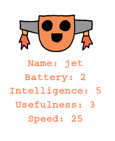

--- challenge ---

## ಸವಾಲು: ರೋಬೋಟ್‌ಗಳಿಗೆ ಹೆಚ್ಚಿನ ಅಂಕಿಅಂಶಗಳನ್ನು(stats) ಸೇರಿಸಿ

ರೋಬೋಟ್‌ಗಳಿಗೆ ಸೇರಿಸಲು ಹೆಚ್ಚಿನ ಅಂಕಿಅಂಶಗಳ(Stats) ಬಗ್ಗೆ ಯೋಚಿಸಬಹುದೇ. ನೀವು 'ವೇಗ' ಅಥವಾ 'ಉಪಯುಕ್ತತೆ' ಅನ್ನು ಸೇರಿಸಬಹುದು ಅಥವಾ ನಿಮ್ಮ ಸ್ವಂತ ಆಲೋಚನೆಗಳೊಂದಿಗೆ ಬರಬಹುದು.

ನೀವು ಇದನ್ನು ಮಾಡಬೇಕಾಗಿದೆ:

+ ಪ್ರತಿ ಹೊಸ ವರ್ಗಕ್ಕೆ ಫೈಲ್‌ಗೆ ಡೇಟಾವನ್ನು ಸೇರಿಸಿ 
+ ಡೇಟಾದಲ್ಲಿ ಓದುವ ಕೋಡ್‌ಗೆ ಹೊಸ ವರ್ಗವನ್ನು ಸೇರಿಸಿ
+ ನೀವು ಟ್ರಂಪ್ ಕಾರ್ಡ್ ಪ್ರದರ್ಶಿಸಿದಾಗ ಹೊಸ ವರ್ಗವನ್ನು ಬರೆಯಿರಿ

ನೀವು ಬಣ್ಣವನ್ನು ಕೂಡ ಸೇರಿಸಬಹುದು ಮತ್ತು ರೋಬೋಟ್‌ಗಳ ಅಂಕಿಅಂಶಗಳನ್ನು(Stats) ಅವುಗಳ ಬಣ್ಣದಲ್ಲಿ ತೋರಿಸಬಹುದು.

ಸುಳಿವು: `color('red')` ಬರೆಯುವ ಮೊದಲು ತುರ್ಟ್ಲೆ (turtle) ಪಠ್ಯವನ್ನು(Text) ಕೆಂಪು ಬಣ್ಣಕ್ಕೆ ಬದಲಾಯಿಸಲು.

ಉದಾಹರಣೆ:

--- /challenge ---