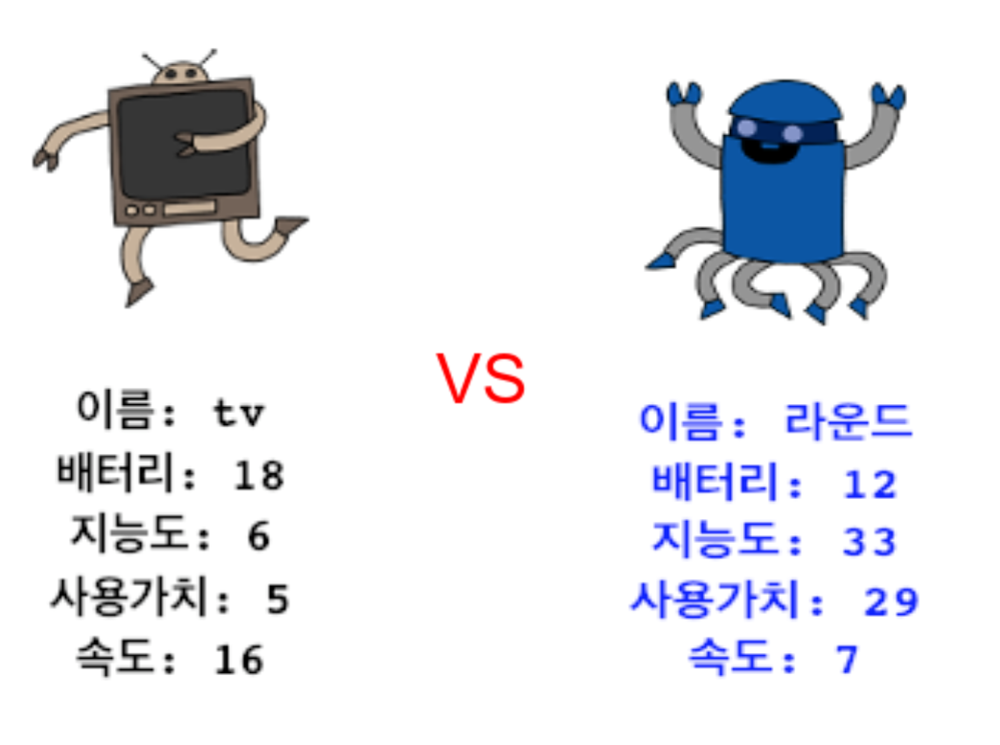

## 소개

이 프로젝트에서 여러분은 파일에서 데이터를 읽어 와 로봇 트럼프 카드를 만들게 됩니다. 그러면 친구와 함께 로봇 트럼프를 할 수 있습니다.

  <iframe src="https://trinket.io/embed/python/9bf93fccd9?outputOnly=true&start=result" width="600" height="500" frameborder="0" marginwidth="0" marginheight="0" allowfullscreen>
  </iframe>
  

### 교육자들을 위한 추가 정보

이 프로젝트를 인쇄하려면 [프린트용 문서](https://projects.raspberrypi.org/ko-KR/projects/robo-trumps/print)를 사용하십시오.

--- collapse ---
---
title: 교육자들을 위한 메모
---

## 소개

이 프로젝트에서 학생들은 파일에서 데이터를 읽어 와 로봇 트럼프 카드를 만들게 됩니다. 그런 다음 카드를 사용하여 친구와 함께 로봇 트럼프를 즐길 수 있습니다.

## 온라인 자료들

**이 프로젝트는 Python 3를 사용합니다.** 파이썬 코드를 온라인에서 작성하기 위해 [Trinket](https://trinket.io/)을 사용하는 것을 추천합니다. 이 프로젝트에 포함된 Trinket은 다음과 같습니다:

* ['로봇 트럼프' 시작점 - jumpto.cc/trumps-go](http://jumpto.cc/trumps-go)

또한 프로젝트의 샘플 정답이 Trinket에 담겨져 있습니다.

* ['Robotrumps' 완성본 - trinket.io/python/9bf93fccd9](https://trinket.io/python/9ccc368bd5)

## 오프라인 자료들

여러분의 선호에 따라 프로젝트를 [오프라인에서 완성](https://www.codeclubprojects.org/en-GB/resources/python-working-offline/)할 수 있습니다. 'Project Materials' 라는 링크를 클릭하여 이 프로젝트의 자료를 확인해볼 수 있습니다. 이 링크에는 어린이들이 프로젝트를 오프라인으로 완료하는 데 필요한 자료가 포함된 'Project Resource' 섹션이 있습니다. 각 어린이가 이러한 자료의 사본에 접근할 수 있는지 확인하십시오. 이 섹션에는 아래와 같은 파일들이 포함되어 있습니다.

* robotrumps/robotrumps.py
* robotrumps/cards.txt
* 여러 로봇 .gif 이미지

이 프로젝트의 완성된 버전은 'Volunteer Resources' 섹션에서 찾을 수 있습니다.

* robotrumps-finished/robotrumps.py
* robotrumps-finished/cards.txt
* 여러 로봇 .gif 이미지

(또한 위의 모든 자료는 프로젝트 및 자원봉사자 `.zip` 파일로 다운로드 할 수 있습니다.)

## 학습 목표

* 통합: 데이터 구조, 파일 읽기, 거북이 그래픽;
* 거북이 그래픽에서 이미지 사용
* Trinket 프로젝트 공유

이 프로젝트는 [라즈베리파이 디지털 메이킹 커리큘럼](http://rpf.io/curriculum) 중 아래의 과정에 있는 요소들을 다룹니다.

* [프로그래밍 구조를 결합하여 문제 해결하기](https://www.raspberrypi.org/curriculum/programming/builder)

## 도전과제

* 더 많은 로봇 추가 - .txt 파일 편집 및 이미지 작업;
* 로봇에 더 많은 정보 추가 - 데이터 처리;
* 친구와 함께 로봇 트럼프 즐기기

## 자주 물어보는 질문

* **오프라인 파이썬은 .png 이미지가 지원되지 않습니다. 오프라인 사용을 위해 .gif 이미지가 제공되었습니다.**
* 이 프로젝트는 텍스트 입력과 거북 그래픽을 모두 사용하므로, 각각의 작은 Trinket에 주어진 공간을 조정할 수 있습니다.
* 입력하기 전에 Trinket 텍스트 창을 클릭해야합니다.
* 어린이들은 자신의 프로젝트에 대한 링크를 얻기 위해 Trinket의 '공유' 옵션을 사용할 수 있습니다. 그들이 전자 메일에 액세스 할 수 있다면 친구에게 링크를 전자 메일로 보낼 수 있습니다. 그렇지 않으면 읽는 것 만으로 종이에 적어 두거나 로컬 네트워크의 텍스트 파일에 저장할 수 있습니다.

--- /collapse ---

--- collapse ---
---
title: Project materials
---

## Project resources

* [프로젝트의 모든 리소스가 들어있는 .zip 파일](resources/robo-trumps-project-resources.zip)
* ['로봇 트럼프' 리소스가 포함 된 온라인 Trinket 자료](http://jumpto.cc/trumps-go)
* [robo-trumps/robo-trumps.py](resources/robo-trumps-robo-trumps.py)
* [robo-trumps/cards.txt](resources/robo-trumps-cards.txt)
* [robo-trumps/space.gif](resources/robo-trumps-space.gif)
* [robo-trumps/rainbow.gif](resources/robo-trumps-rainbow.gif)
* [robo-trumps/bird.gif](resources/robo-trumps-bird.gif)
* [robo-trumps/dog.gif](resources/robo-trumps-dog.gif)
* [robo-trumps/jet.gif](resources/robo-trumps-jet.gif)
* [robo-trumps/round.gif](resources/robo-trumps-round.gif)
* [robo-trumps/brains.gif](resources/robo-trumps-brains.gif)
* [robo-trumps/twoheads.gif](resources/robo-trumps-twoheads.gif)
* [robo-trumps/shades.gif](resources/robo-trumps-shades.gif)
* [robo-trumps/hair.gif](resources/robo-trumps-hair.gif)
* [robo-trumps/tv.gif](resources/robo-trumps-tv.gif)
* [robo-trumps/yellow.gif](resources/robo-trumps-yellow.gif)

## 교육자를 위한 자료

* [완료된 프로젝트 리소스가 담긴 .zip 파일](resources/robotrumps-volunteer-resources.zip)
* [완성된 온라인 Trinket 프로젝트](https://trinket.io/python/9bf93fccd9)
* [robo-trumps-finished/robo-trumps.py](resources/robo-trumps-finished-robo-trumps.py)
* [robo-trumps-finished/cards.txt](resources/robo-trumps-finished-cards.txt)
* [robo-trumps-finished/space.gif](resources/robo-trumps-finished-space.gif)
* [robo-trumps-finished/rainbow.gif](resources/robo-trumps-finished-rainbow.gif)
* [robo-trumps-finished/bird.gif](resources/robo-trumps-finished-bird.gif)
* [robo-trumps-finished/dog.gif](resources/robo-trumps-finished-dog.gif)
* [robo-trumps-finished/jet.gif](resources/robo-trumps-finished-jet.gif)
* [robo-trumps-finished/round.gif](resources/robo-trumps-finished-round.gif)
* [robo-trumps-finished/brains.gif](resources/robo-trumps-finished-brains.gif)
* [robo-trumps-finished/twoheads.gif](resources/robo-trumps-finished-twoheads.gif)
* [robo-trumps-finished/shades.gif](resources/robo-trumps-finished-shades.gif)
* [robo-trumps-finished/hair.gif](resources/robo-trumps-finished-hair.gif)
* [robo-trumps-finished/tv.gif](resources/robo-trumps-finished-tv.gif)
* [robo-trumps-finished/yellow.gif](resources/robo-trumps-finished-yellow.gif)

--- /collapse ---