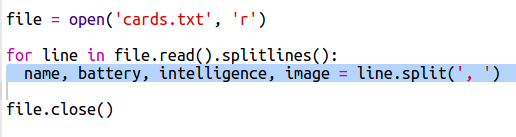

## 파일에서 로봇 데이터 읽기

파일에서 정보를 읽는 것이 유용한 경우가 많습니다. 파일에서 정보를 읽으면 코드를 수정하지 않아도 정보를 변경할 수 있습니다.

+ 다음 Trinket 파일을 열어주세요. <a href="http://jumpto.cc/trumps-go" target="_blank">jumpto.cc/trumps-go</a>.

+ 시작하는 프로젝트에는 로봇에 대한 데이터를 담고 있는 `cards.txt` 파일이 포함되어 있습니다.
    
    `cards.txt`를 클릭하여 데이터를 볼 수 있습니다:
    
    
    
    각 라인에는 로봇에 대한 데이터가 있습니다. 데이터 항목은 쉼표로 구분됩니다.
    
    각 행은 다음 정보를 포함합니다:
    
    이름, 지능 레벨, 배터리 잔량, 이미지 파일 이름

+ 파일에서 데이터를 읽어서 사용할 수 있도록 하세요.
    
    첫 번째 단계는 스크립트에서 `cards.txt` 파일을 여는 것입니다:
    
    

+ 이제 파일에서 데이터를 읽도록 합니다:
    
    

+ 프로그램이 끝날 때 꼭 파일 함수를 종료해야 합니다:
    
    

+ 파일의 텍스트는 하나의 문자열로 제공되기 때문에, 특수 문자를 기준으로 각각의 데이터로 나누어야 합니다.
    
    먼저 파일의 텍스트를 리스트로 표현할 수 있습니다.
    
    
    
    출력 결과를 자세히 보세요. 목록에 세 개의 항목이 있으며 각 항목은 파일의 한 줄입니다.

+ 이제 한 줄의 내용을 한번에 출력할 수 있습니다.
    
    

+ 텍스트를 출력하는 대신, 내용을 변수에 저장합니다:
    
    

+ 나중에 이 데이터를 사용하여 특정 로봇의 데이터를 조회할 수 있어야 하기 때문에, 로봇의 이름을 딕셔너리의 키로 사용합시다.
    
    `robots` 딕셔너리 변수를 선언합니다:
    
    

+ 이제 각 로봇에 대한 데이터를 딕셔너리 별로 추가해 보겠습니다.
    
    이름이 키이고 변수는 각 로봇의 데이터들입니다.
    
    아래에 표시한 코드를 추가하세요.
    
    
    
    스크립트를 테스트 한 후 `print robots` 코드를 제거하도록 합니다.