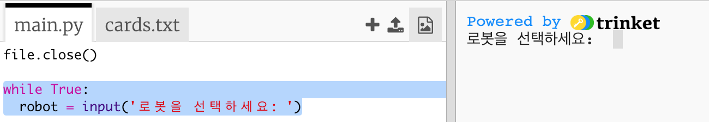
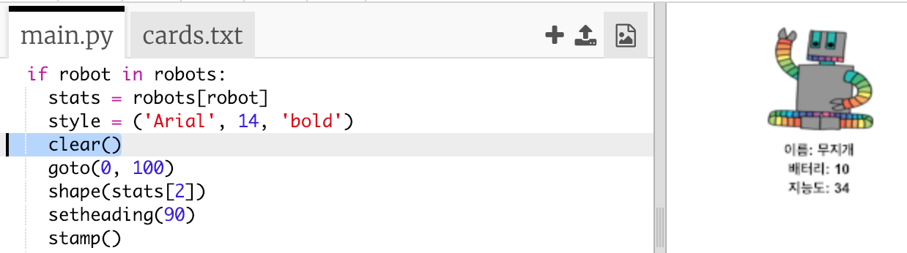

## 데이터 표시

이제 로봇 데이터를 보다 재미있는 방식으로 표시 할 수 있습니다.

지능도와 사용가치를 이해하기 위해 이미지와 데이터가 있는 로봇 트럼프 카드가 보이도록 프로그래밍해 봅시다.

이 단계를 완료하면 다음과 같이 로봇을 출력할 수 있습니다.

+ 사용자에게 어떤 로봇을 보고 싶은지 묻습니다:
    
    

+ 로봇이 딕셔너리에 있으면 데이터를 검색합니다:
    
    
    
    로봇 이름을 입력하여 코드를 테스트해 보세요.

+ 로봇이 존재하지 않으면 오류가 일어나지 않도록 아래와 같이 메시지를 출력해야 합니다:
    
    
    
    딕셔너리에 없는 로봇 이름을 입력하여 코드를 테스트해 보세요.

+ 이제 Python 거북이를 사용하여 로봇 데이터를 표시해 보겠습니다.
    
    스크립트 상단에 거북이 라이브러리를 불러오고, screen, turtle을 설정하세요.
    
    

+ 아래와 같이 로봇의 이름을 출력하는 코드를 작성하세요.
    
    

+ 텍스트가 만족스러울 때까지 `style` 변수를 변경하십시오.
    
    이 문서에서 제공되는 폰트는 `Arial`이나 한글이 작게 표시된다는 장점이 있습니다. `Courier`, `Times`, `Verdana` 등의 폰트를 사용해 보세요.
    
    글씨가 너무 작다면 `14` 를 다른 숫자로 변경합니다.
    
    `bold`를 `normal`로 변경하거나, `italic`을 사용하여 폰트가 기울도록 변경할 수 있습니다.

+ 로봇에 대한 데이터를 출력하는 대신 변수에 저장하세요.
    
    

+ 이제 로봇 데이터에 리스트로 접근할 수 있습니다.
    
    + `stats[0]`는 지능도를 의미합니다.
    + `stats[1]` 는 배터리 잔량을 의미합니다.
    + `stats[2]`는 이미지 이름을 의미합니다.
    
    지능도 및 배터리 잔량을 표시하는 코드를 추가하세요:
    
    

+ 이런! 텍스트가 겹쳐 있습니다. 거북이를 이동하는 코드를 추가해야 합니다:
    
    

+ 마지막으로, 로봇 이미지를 추가해 보도록 하겠습니다.
    
    `cards.txt`의 데이터를 읽어 올 때 이미지를 등록하는 라인을 추가합니다:
    
    

+ 이미지를 배치하는 코드를 추가하세요:
    
    

+ 하나의 로봇을 불러오고, 다른 로봇을 불러와 코드를 테스트하면 기존 로봇이 사라지지 않고 그냥 위에 표시되는 것을 볼 수 있습니다!
    
    새로운 로봇을 표시하기 전에 기존 로봇을 지워야 합니다.
    
    