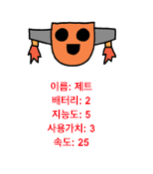

--- challenge ---

## 과제: 로봇에 더 많은 데이터 추가

로봇에 더 많은 데이터를 추가 할 수 있나요? '속도' 또는 '사용가치'를 추가하거나 다른 데이터를 추가해 보세요.

아래와 같은 작업이 필요합니다:

+ 새로운 데이터마다 각 줄(로봇) 에 데이터 추가 
+ 데이터를 읽는 코드에 새 데이터를 읽도록 설정하기
+ 트럼프 카드를 표시 할 때 새 카테고리 제작

색상을 추가하고 로봇의 데이터를 자신의 색상으로 표시 할 수도 있습니다.

힌트: 텍스트를 빨간색으로 변경하려면 `color('red')` 를 사용하세요.

예시:

--- /challenge ---