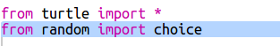
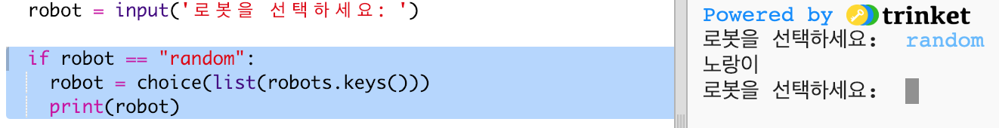

## 랜덤한 로봇 표시

로봇 이름 대신 'random' 을 입력 할 때 임의의 로봇이 출력되도록 코드를 추가합시다.

+ 먼저 random 모듈에서 choice 함수를 불러 와야 합니다.
    
    

+ `choice`를 사용하여 로봇 딕셔너리의 키 목록에서 임의의 로봇 이름을 선택할 수 있습니다.
    
    

+ Python 3에서는 `keys`의 결과를 리스트로 바꾸기 위해 `list`를 사용해야 합니다.
    
    팁: 대괄호를 제대로 확인하세요!