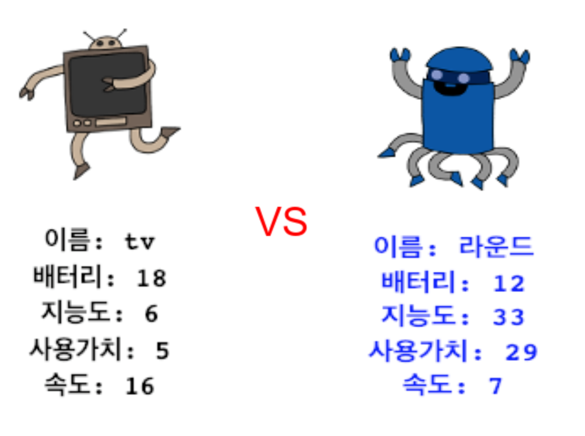

\--- challenge \---

## 과제: 친구와 함께하는 로봇 트럼프 게임!

친구와 프로젝트를 공유하고 로봇 트럼프 게임을 즐겨보세요. 둘 다 같은 프로젝트를 사용하니 공평합니다! 플레이어 1은 랜덤한 로봇을 요청한 다음 카테고리(배터리, 속도 등)를 선택합니다. 그러면 플레이어 2가 랜덤한 로봇을 요청하고 선택한 카테고리에 대해 누가 가장 높은 점수를 받았는지 확인한 다음 카드를 교환합니다.

동일한 카드 덱으로 게임을 즐기는 것이 가장 효과적일 것입니다. 친구에게 Trinket 프로젝트에 대한 링크를 공유하면 둘 다 같은 동일한 카드 덱을 사용할 수 있습니다.

\--- /challenge \---