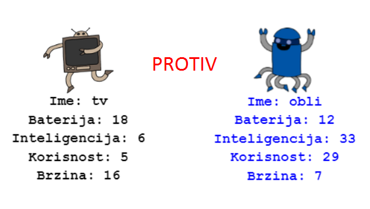

## Introduction

In this project you will read data from a file to create robot trump cards. Then you can play Robo-Trumps with a friend.

  <iframe src="https://trinket.io/embed/python/9ccc368bd5?outputOnly=true&start=result" width="600" height="500" frameborder="0" marginwidth="0" marginheight="0" allowfullscreen>
  </iframe>
  

### Additional information for club leaders

If you need to print this project, please use the [Printer friendly version](https://projects.raspberrypi.org/en/projects/robo-trumps/print).

## \--- collapse \---

## title: Club leader notes

## Introduction:

In this project learners will read data from a file into a dictionary, to create robot trump cards. The cards can then be used to play Robo-Trumps with a friend.

## Online Resources

**This project uses Python 3.** We recommend using [trinket](https://trinket.io/) to write Python online. This project contains the following Trinkets:

* ['Robotrumps' starting point -- jumpto.cc/trumps-go](http://jumpto.cc/trumps-go)

There is also a trinket containing a sample solution to the challenges:

* [‘Robotrumps’ Finished -- trinket.io/python/9ccc368bd5](https://trinket.io/python/9ccc368bd5)

## Offline Resources

This project can be [completed offline](https://www.codeclubprojects.org/en-GB/resources/python-working-offline/) if preferred. You can access the project resources by clicking the 'Project Materials' link for this project. This link contains a 'Project Resources' section, which includes resources that children will need to complete this project offline. Make sure that each child has access to a copy of these resources. This section includes the following files:

* robotrumps/robotrumps.py
* robotrumps/cards.txt
* Several robot .gif images

You can also find a completed version of this project's challenges in the 'Volunteer Resources' section, which contains:

* robotrumps-finished/robotrumps.py
* robotrumps-finished/cards.txt
* Several robot .gif images

(All of the resources above are also downloadable as project and volunteer `.zip` files.)

## Learning Objectives

* Consolidation: data structures, reading from file and turtle graphics;
* Using images in turtle graphics;
* Sharing trinket projects.

This project covers elements from the following strands of the [Raspberry Pi Digital Making Curriculum](http://rpf.io/curriculum):

* [Combine programming constructs to solve a problem.](https://www.raspberrypi.org/curriculum/programming/builder)

## Challenges

* Add more robots - Editing a .txt file and working with images;
* Add more stats to the robots - handling data;
* Play Robotrumps with a friend.

## Frequently Asked Questions

* **Offline Python does not work with .png images. .gif images have been supplied for offline use.**
* Note that this project uses both text input and turtle graphics, you can adjust the amount of space given to each in trinket.
* You need to click in the trinket text window before typing.
* Children can use the 'Share' option in trinket to get a link to their project. If they have access to email then they can email the link to a friend, otherwise they can just read it out, note it down on a piece of paper or save it in a text file on the local network.

\--- /collapse \---

## \--- collapse \---

## title: Project materials

## Project resources

* [.zip file containing all project resources](resources/robo-trumps-project-resources.zip)
* [Online Trinket containing 'Robo-Trumps' starter resources](http://jumpto.cc/trumps-go)
* [robo-trumps/robo-trumps.py](resources/robo-trumps-robo-trumps.py)
* [robo-trumps/cards.txt](resources/robo-trumps-cards.txt)
* [robo-trumps/space.gif](resources/robo-trumps-space.gif)
* [robo-trumps/rainbow.gif](resources/robo-trumps-rainbow.gif)
* [robo-trumps/bird.gif](resources/robo-trumps-bird.gif)
* [robo-trumps/dog.gif](resources/robo-trumps-dog.gif)
* [robo-trumps/jet.gif](resources/robo-trumps-jet.gif)
* [robo-trumps/round.gif](resources/robo-trumps-round.gif)
* [robo-trumps/brains.gif](resources/robo-trumps-brains.gif)
* [robo-trumps/twoheads.gif](resources/robo-trumps-twoheads.gif)
* [robo-trumps/shades.gif](resources/robo-trumps-shades.gif)
* [robo-trumps/hair.gif](resources/robo-trumps-hair.gif)
* [robo-trumps/tv.gif](resources/robo-trumps-tv.gif)
* [robo-trumps/yellow.gif](resources/robo-trumps-yellow.gif)

## Club leader resources

* [.zip file containing all completed project resources](resources/robotrumps-volunteer-resources.zip)
* [Online completed Trinket project](https://trinket.io/python/9ccc368bd5)
* [robo-trumps-finished/robo-trumps.py](resources/robo-trumps-finished-robo-trumps.py)
* [robo-trumps-finished/cards.txt](resources/robo-trumps-finished-cards.txt)
* [robo-trumps-finished/space.gif](resources/robo-trumps-finished-space.gif)
* [robo-trumps-finished/rainbow.gif](resources/robo-trumps-finished-rainbow.gif)
* [robo-trumps-finished/bird.gif](resources/robo-trumps-finished-bird.gif)
* [robo-trumps-finished/dog.gif](resources/robo-trumps-finished-dog.gif)
* [robo-trumps-finished/jet.gif](resources/robo-trumps-finished-jet.gif)
* [robo-trumps-finished/round.gif](resources/robo-trumps-finished-round.gif)
* [robo-trumps-finished/brains.gif](resources/robo-trumps-finished-brains.gif)
* [robo-trumps-finished/twoheads.gif](resources/robo-trumps-finished-twoheads.gif)
* [robo-trumps-finished/shades.gif](resources/robo-trumps-finished-shades.gif)
* [robo-trumps-finished/hair.gif](resources/robo-trumps-finished-hair.gif)
* [robo-trumps-finished/tv.gif](resources/robo-trumps-finished-tv.gif)
* [robo-trumps-finished/yellow.gif](resources/robo-trumps-finished-yellow.gif)

\--- /collapse \---