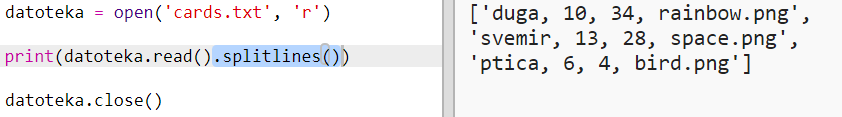

## Učitaj podatke o robotu iz datoteke

Učitavanje informacija iz datoteke je često korisno. Na taj način ne treba da mijenjaš svoj kôd, već možeš da izmijeniš podatke u datoteci.

+ Otvori sljedeći trinket: <a href="http://jtrinket.io/python/e2a0a2dce2" target="_blank">jtrinket.io/python/e2a0a2dce2</a>.

+ U tvom početnom projektu nalazi se datoteka `cards.txt` koja sadrži podatke o robotima.
    
    Klikni na `cards.txt` za pregled podataka:
    
    
    
    Svaki red sadrži podatke o jednom robotu. Podaci unutar redova odvojeni su zarezima.
    
    Svaki red sadrži sljedeće informacije:
    
    ime, nivo inteligencije, trajanje baterije, naziv slikovne datoteke

+ Učitajmo podatke iz datoteke kako bismo ih mogli koristiti.
    
    Prvo otvori `cards.txt` datoteku u svojoj skripti:
    
    

+ Sada možeš da učitaš podatke iz datoteke:
    
    

+ Uvijek zatvori datoteku nakon što završiš sa njenim korišćenjem:
    
    

+ Ovo nam daje datoteku kao jedan znakovni niz koji treba da rastavimo na pojedinačne dijelove podataka.
    
    Prvo možeš da podijeliš datoteku u listu redova:
    
    
    
    Pažljivo pogledaj ispis. U listi se nalaze tri elementa, a svaki elemenat je jedan red iz datoteke.

+ Sada možeš proći petljom kroz svaki red pojedinačno.
    
    

+ Umjesto ispisivanja redova, smjesti ih u promjenljive:
    
    

+ Želiš da ti ovi podaci budu i kasnije dostupni za pronalaženje vrijednosti određenog robota. Koristićemo ime robota kao ključ u rječniku.
    
    Dodaj rječnik sa nazivom `roboti`:
    
    

+ Sada u rječnik robota dodajmo elemenat za svakog robota.
    
    Ime robota je ključ, a vrijednost je lista podataka za tog robota.
    
    Dodaj označeni kôd:
    
    
    
    Možeš ukloniti `print roboti` nakon što isprobaš svoju skriptu.