## Prikaži podatke

Sada možeš da prikažeš podatke o robotu na zanimljiviji način.

Prikažimo kartu sa slikom robota i podacima o njegovoj inteligenciji i korisnosti.

Kada to napraviš, moći ćeš ovako da prikažeš robote:

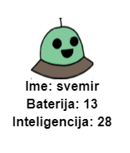

+ Pitaj korisnika kojeg robota želi da vidi:
    
    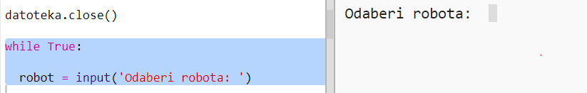

+ Ako se robot nalazi u rječniku, potraži njegove podatke:
    
    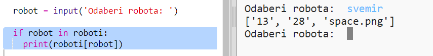
    
    Isprobaj svoj kôd unošenjem robotovog imena.

+ Ako robot ne postoji, prikaži poruku o grešci:
    
    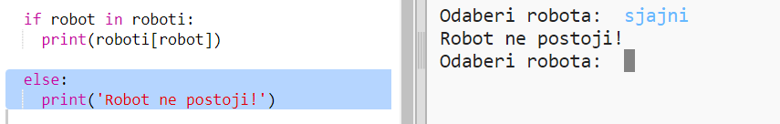
    
    Isprobaj svoj kôd unošenjem imena robota koji se ne nalazi u rječniku.

+ Sada ćeš koristiti Python kornjaču za prikazivanje podataka o robotu.
    
    Uvezi biblioteku 'turtle' na početku svoje skripte i podesi ekran i kornjaču (turtle):
    
    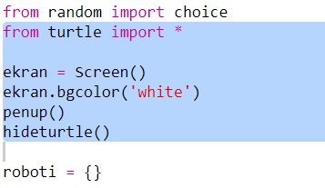

+ Sada dodaj kôd da kornjača ispiše ime robota:
    
    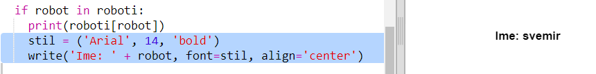

+ Probaj da mijenjaš promjenljivu `stil` dok ne budeš zadovoljan/zadovoljna tekstom.
    
    Umjesto `Arial` možeš isprobati: `Courier`, `Times` ili `Verdana`.
    
    Promijeni `14` u neki drugi broj da izmijeniš veličinu fonta.
    
    Možeš promijeniti `bold` u `normal` ili `italic`.

+ Smjesti listu podataka o robotu u promjenljivu, umjesto da je ispisuješ:
    
    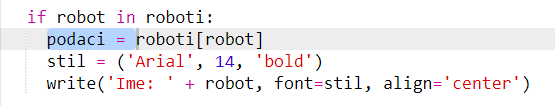

+ Sada možeš pristupati podacima o robotu kao elementima u listi:
    
    + `podaci[0]` je inteligencija
    + `podaci[1]` je baterija
    + `podaci[2]` je naziv slike
    
    Dodaj kôd za prikazivanje podataka o inteligenciji i bateriji:
    
    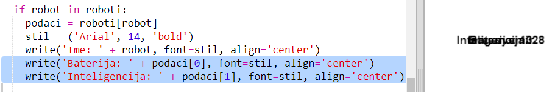

+ O, ne! Podaci su ispisani jedan preko drugog. Moraš dodati kôd za pomjeranje kornjače:
    
    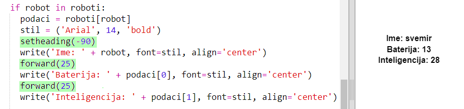

+ I na kraju, dovršimo prikaz dodajući sliku robota.
    
    Treba da dodaš red za registrovanje slike pri učitavanju podataka iz `cards.txt`:
    
    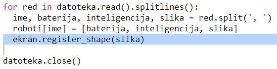

+ Dodaj i kôd za pozicioniranje i prikazivanje slike:
    
    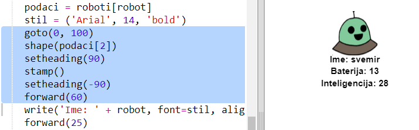

+ Isprobaj svoj kôd tako što ćeš unijeti jednog robota, a zatim drugog. Vidjećeš da se prikazuju jedan preko drugog!
    
    Treba da obrišeš ekran prije prikazivanja robota:
    
    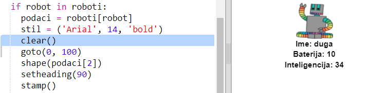