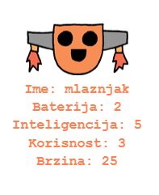

\--- challenge \---

## Izazov: Dodaj još podataka o robotima

Možeš li smisliti još podataka koje ćeš dodati robotima? Možeš da dodaš 'brzinu' ili 'korisnost' ili da koristiš svoje ideje.

Potrebno je da:

+ Dodaš podatke u datoteku za svaku novu kategoriju 
+ Dodaš novu kategoriju u kôd koji učitava podatke
+ Ispišeš novu kategoriju pri prikazivanju karte robota

Možeš da dodaš i boju i prikažeš podatke o svakom robotu u drugoj boji.

Pomoć: Koristi `color('red')` da promijeniš boju kornjačinog teksta u crvenu prije pisanja.

Primjer:

\--- /challenge \---