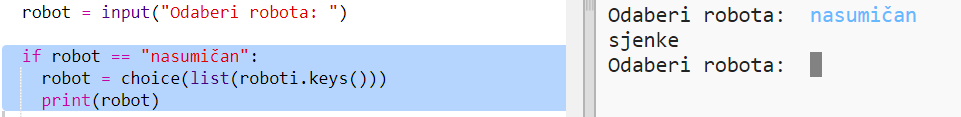

## Prikaži nasumičnog robota

Dodajmo kôd da dobiješ nasumičnog robota kada upišeš 'nasumičan' umjesto robotovog imena.

+ Prvo treba da uvezeš funkciju 'choice' iz modula 'random':
    
    

+ Možeš da koristiš `choice` za odabir nasumičnog imena robota iz liste ključeva u rječniku 'roboti'.
    
    

+ U Pythonu 3 moraš da koristiš `list` za pretvaranje rezultata `ključeva` (keys) u listu.
    
    Savjet: Pažljivo provjeri svoje zagrade!