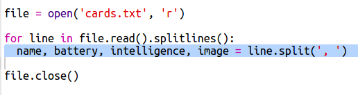
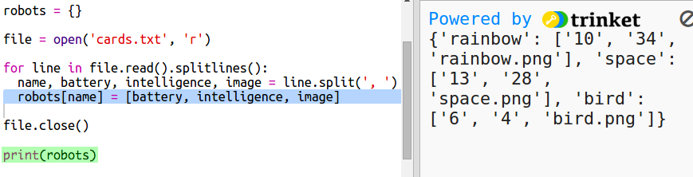

## फाईलमधून रोबोटचा डेटा वाचा

फाईलमधून माहिती वाचने कार्य कण्यास सक्षम होण्यासाठी बर्‍याचदा उपयुक्त आहे. त्यानंतर तुम्ही तुमचा कोड न बदलता फाइलमधील डेटा बदलू शकता.

+ हे ट्रिंकेट उघडा: <a href="http://jumpto.cc/trumps-go" target="_blank"> jumpto.cc/trumps-go </a> .

+ तुमच्या प्रारंभिक प्रकल्पामध्ये `cards.txt` फाईलमध्ये रोबोट्सबद्दल डेटा समाविष्ट आहे.
    
    डेटा पाहण्यासाठी `cards.txt` वर क्लिक करा :
    

    
    प्रत्येक ओळीत रोबोटचा डेटा असतो. डेटा आयटम स्वल्पविरामाने विभक्त केले जातात.
    
    प्रत्येक ओळीत पुढील माहिती असते:
    
    नाव, बुद्धिमत्ता रेटिंग, बॅटरी किती काळ टिकते, प्रतिमा फाइलचे नाव

+ तुम्ही फाईलमधील डेटा वाचा म्हणजे त्याचा वापर करू शकाल.
    
    प्रथम चरण `cards.txt` फाइल तुमच्या स्क्रिप्ट मध्ये उघडणे आहे:
    

+ आता तुम्ही फाईलमधील डेटा वाचू शकता:
    
    

+ जेव्हा तुम्ही एखादी फाइल संपविली तेव्हा तुम्ही ती नेहमी बंद केली पाहिजे:
    
    

+ ती तुम्हाला एक डेटा मालिका असलेली फाइल म्हणून देते, तुम्हाला ती डेटाच्या स्वतंत्र तुकड्यात विभागण्याची आवश्यकता आहे.
    
    पहिल्यांदा, तुम्ही फाईल लाइनच्या यादीमध्ये विभाजित करू शकता:
    
    
    
    आउटपुट काळजीपूर्वक पहा. यादीमध्ये तीन साहित्य आहेत, प्रत्येक फाईलमधील एक ओळ आहे.

+ आता तुम्ही एकाच वेळी त्या लाइनवर लूप करू शकता
    
    

+ लाइन प्रिंट करण्याऐवजी त्या व्हेरिएबल्समध्ये वाचा:
    
    

+ विशिष्ट रोबोटची मूल्ये शोधण्यासाठी तुम्ही हा डेटा नंतर वापरण्यास सक्षम होऊ इच्छित आहात. शब्दकोशाची की म्हणून रोबोटचे नाव वापरू.
    
    `robots` शब्दकोश जोडा:
    
    

+ आता प्रत्येक रोबोटसाठी रोबोट शब्दकोषात प्रविष्टी जोडा.
    
    नाव की आहे आणि मूल्य त्या रोबोच्या डेटाची यादी आहे.
    
    हायलाइट केलेला कोड जोडा:
    
    
    
    तुम्ही `print robots` काढू शकता जेव्हा तुम्ही तुमच्या स्क्रिप्टची चाचणी घेतली असाल.