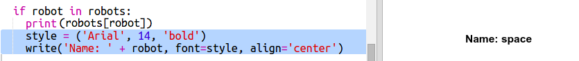
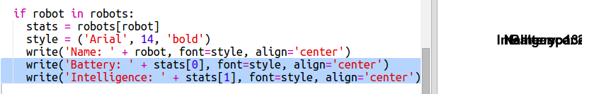
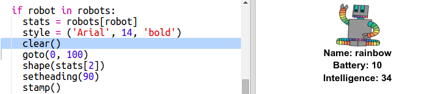

## डेटा प्रदर्शित करा

आता तुम्ही अधिक रोचक मार्गाने रोबोट डेटा प्रदर्शित करू शकता.

चला रोबोटची बुद्धिमत्ता आणि उपयुक्ततेसाठी प्रतिमा आणि डेटासह असलेले रोबोट ट्रम्प कार्ड प्रदर्शित करूया.

तुम्ही हे चरण पूर्ण केल्यावर तुम्ही पुढीलप्रमाने रोबोट प्रदर्शित करण्यास सक्षम असाल:

+ वापरकर्त्याला कोणता रोबो पहायला आवडेल ते विचारा:
    
    

+ रोबोट शब्दकोषात असल्यास त्याचा डेटा पहा:
    
    
    
    रोबोटचे नाव देऊन आपल्या कोडची चाचणी घ्या.

+ जर रोबोट अस्तित्वात नसेल तर त्रुटी द्या:
    
    
    
    शब्दकोशात नसलेले रोबोट नाव प्रविष्ट करून तुमच्या कोडची चाचणी घ्या.

+ आता तुम्ही रोबोट डेटा प्रदर्शित करण्यासाठी python टर्टल वापरणार आहात.
    
    तुम्ही स्क्रिप्टच्या शीर्षस्थानी टर्टल लायब्ररी सुचित करा आणि स्क्रीन व टर्टलची रचना करा:
    
    

+ रोबोटचे नाव छापण्यासाठी टर्टल मिळविण्यासाठी कोड जोडा:
    
    

+ तुम्ही `style` बदलण्याचा प्रयत्न करा टेक्स्ट योग्य होईपर्यंत व्हेरिएबल बदलू शकता.
    
    `एरियल` ऐवजी आपण प्रयत्न करू शकता: `Courier`, `Times` किंवा `Verdana`.
    
    `14` ऐवजी फॉन्टचा आकार बदलण्यासाठी वेगळा क्रमांक निवडून पाहा.
    
    तुम्ही `bold` ते `normal` किंवा `italic` बदलू शकता.

+ रोबोटच्या आकडेवारीची यादी मुद्रित करण्याऐवजी व्हेरिएबलमध्ये संचयित करा:
    
    

+ आता यादीतील बाबी म्हणून तुम्ही रोबोटच्या आकडेवारीवर प्रवेश करू शकता:
    
    + `stats[0]` बुद्धिमत्ता आहे
    + `stats[1]` बॅटरी आहे
    + `stats[2]` प्रतिमा नाव आहे
    
    बुद्धिमत्ता आणि बॅटरी आकडेवारी प्रदर्शित करण्यासाठी कोड जोडा:
    
    

+ अरे मित्रा! सर्व आकडेवारी एकमेकांच्या वर आहेत. टर्टल हलविण्यासाठी तुम्हाला कोड जोडण्याची आवश्यकता आहे:
    
    

+ आणि शेवटी, प्रदर्शन पूर्ण करण्यासाठी रोबॉटच्या प्रतिमा जोडा.
    
    तुम्ही `cards.txt` वरील डेटा वाचता तेव्हा तुम्हाला प्रतिमा नोंदणी करण्यासाठी एक ओळ जोडण्याची आवश्यकता असेल :
    
    

+ आणि प्रतिमेला स्थितीत आणि मुद्रांकित करण्यासाठी कोड जोडा:
    
    

+ तुमच्या कोडची चाचणी घेण्यासाठी एक रोबोट आणि नंतर दुसरा प्रविष्ट करा आणि तुम्हाला त्या एकमेकांच्यात वरचढ रोबोट दिसेल!
    
    रोबोट प्रदर्शित करण्यापूर्वी तुम्हाला स्क्रीन क्लिअर करणे आवश्यक आहे:
    
    