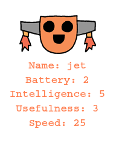

--- challenge ---

## आव्हान: रोबोटमध्ये अधिक आकडेवारी जोडा

तुमच्या रोबोटमध्ये जोडण्यासाठी अधिक आकडेवारीबद्दल विचार करू शकता? तुम्ही 'speed' किंवा 'usefulness' जोडू शकता किंवा तुमच्या स्वतःच्या संकल्पना देवू शकता.

तुम्हाला खालील गोष्टी कराव्या लागतील:

+ प्रत्येक नवीन श्रेणीसाठी फाईलमध्ये डेटा जोडा 
+ डेटामध्ये वाचणार्‍या कोडमध्ये नवीन श्रेणी जोडा
+ तुम्ही ट्रम्प कार्ड प्रदर्शित करता तेव्हा नवीन श्रेणी लिहा

तुम्ही रोबोटसाठी एक रंग जोडू शकता आणि त्यांच्या स्वत: च्या रंगात आकडेवारी देखील दर्शवू शकता.

संकेतः लिहिण्यापूर्वी टर्टल टेक्स्ट लाल रंगात बदलण्यासाठी `color('red')`वापरा.

उदाहरणः

--- /challenge ---