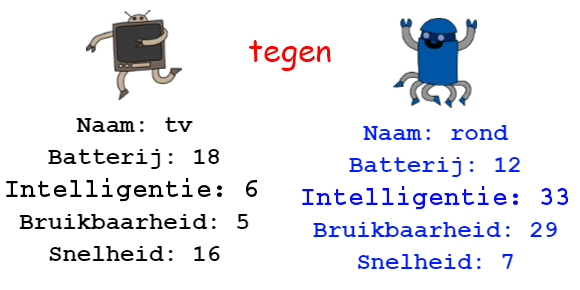

## Inleiding

In dit project lees je gegevens uit een bestand om robot troefkaarten te maken. Dan kun je Robo-Troef met een vriend spelen.

  <iframe src="https://trinket.io/embed/python/9ccc368bd5?outputOnly=true&start=result" width="600" height="500" frameborder="0" marginwidth="0" marginheight="0" allowfullscreen>
  </iframe>
  

### Aanvullende informatie voor clubleiders

Als je dit project wilt afdrukken, gebruik dan de [Printervriendelijke versie](https://projects.raspberrypi.org/en/projects/robo-trumps/print).

## \--- collapse \---

## title: Clubleider notities

## Inleiding:

In dit project lezen leerlingen gegevens uit een bestand en zetten deze in een reeks om robot troefkaarten te maken. De kaarten kunnen vervolgens worden gebruikt om met een vriend Robo-Troef te spelen.

## Online bronnen

**Dit project maakt gebruik van Python 3.** We raden aan om [trinket](https://trinket.io/) te gebruiken om Python online te schrijven. Dit project bevat de volgende Trinkets:

* [Startpunt van 'RoboTroef' - jumpto.cc/trumps-go](http://jumpto.cc/trumps-go)

Er is ook een trinket met een voorbeeldoplossing voor de uitdagingen:

* [Een voltooide 'RoboTroef' vindt je hier - trinket.io/python/9ccc368bd5](https://trinket.io/python/9ccc368bd5)

## Offline bronnen

Dit project kan [offline worden voltooid](https://www.codeclubprojects.org/en-GB/resources/python-working-offline/) als dit de voorkeur heeft. Je kunt toegang krijgen tot de projectbronnen door op de koppeling 'Projectmaterialen' voor dit project te klikken. Deze link bevat een 'Projectbronnen'-sectie die bronnen bevat om dit project offline te voltooien. Zorg ervoor dat elk kind toegang heeft tot een kopie van deze bronnen. Dit gedeelte bevat de volgende bestanden:

* robotrumps/robotrumps.py
* robotrumps/cards.txt
* Verschillende robot.gif-afbeeldingen

Je kunt ook een voltooide versie van de uitdagingen van dit project vinden in de sectie 'Vrijwilligersbronnen', die bevat:

* robotrumps-finished/robotrumps.py
* robotrumps-finished/cards.txt
* Verschillende robot.gif-afbeeldingen

(Alle bovenstaande bronnen kunnen ook worden gedownload als project en als vrijwilliger `.zip` bestanden.)

## Leerdoelen

* Consolidatie: gegevensstructuren, lezen van bestanden en turtle graphics;
* Afbeeldingen gebruiken in turtle graphics;
* Trinket-projecten delen.

Dit project behandelt elementen uit de volgende onderdelen van het [Raspberry Pi Digital Making Curriculum](http://rpf.io/curriculum):

* [Combineer programmeerconstructies om een ​​probleem op te lossen.](https://www.raspberrypi.org/curriculum/programming/builder)

## Uitdagingen

* Voeg meer robots toe - Bewerk een .txt-bestand en werk met afbeeldingen;
* Voeg meer gegevens toe aan de robots - verwerken van gegevens;
* Speel RoboTroef met een vriend.

## Veel Gestelde Vragen (Faq)

* **Offline Python werkt niet met .png-afbeeldingen. .gif-afbeeldingen zijn geleverd voor offline gebruik.**
* Merk op dat dit project zowel tekstinvoer als turtle graphics gebruikt, in trinket kun je de grootte van het venster die aan beide wordt gegeven, aanpassen.
* Je moet in het trinket-tekstvenster klikken voordat je gaat typen.
* Kinderen kunnen de optie 'Delen' in trinket gebruiken om een ​​link naar hun project te krijgen. Als ze toegang hebben tot e-mail, kunnen ze de link naar een vriend e-mailen, anders kunnen ze het gewoon voorlezen, opschrijven of opslaan in een tekstbestand op het lokale netwerk.

\--- /collapse \---

## \--- collapse \---

## title: Projectmaterialen

## Projectbronnen

* [.zip-bestand met alle projectbronnen](resources/robo-trumps-project-resources.zip)
* [Online Trinket met 'Robo-Troef' start hulpmiddelen](http://jumpto.cc/trumps-go)
* [robo-trumps/robo-trumps.py](resources/robo-trumps-robo-trumps.py)
* [robo-trumps/cards.txt](resources/robo-trumps-cards.txt)
* [robo-trumps/space.gif](resources/robo-trumps-space.gif)
* [robo-trumps/rainbow.gif](resources/robo-trumps-rainbow.gif)
* [robo-trumps/bird.gif](resources/robo-trumps-bird.gif)
* [robo-trumps/dog.gif](resources/robo-trumps-dog.gif)
* [robo-trumps/jet.gif](resources/robo-trumps-jet.gif)
* [robo-trumps/round.gif](resources/robo-trumps-round.gif)
* [robo-trumps/brains.gif](resources/robo-trumps-brains.gif)
* [robo-trumps/twoheads.gif](resources/robo-trumps-twoheads.gif)
* [robo-trumps/shades.gif](resources/robo-trumps-shades.gif)
* [robo-trumps/hair.gif](resources/robo-trumps-hair.gif)
* [robo-trumps/tv.gif](resources/robo-trumps-tv.gif)
* [robo-trumps/yellow.gif](resources/robo-trumps-yellow.gif)

## Clubleider bronnen

* [.zip-bestand met alle voltooide projectbronnen](resources/robotrumps-volunteer-resources.zip)
* [Online voltooid Trinket-project](https://trinket.io/python/9ccc368bd5)
* [robo-trumps-finished/robo-trumps.py](resources/robo-trumps-finished-robo-trumps.py)
* [robo-trumps-finished/cards.txt](resources/robo-trumps-finished-cards.txt)
* [robo-trumps-finished/space.gif](resources/robo-trumps-finished-space.gif)
* [robo-trumps-finished/rainbow.gif](resources/robo-trumps-finished-rainbow.gif)
* [robo-trumps-finished/bird.gif](resources/robo-trumps-finished-bird.gif)
* [robo-trumps-finished/dog.gif](resources/robo-trumps-finished-dog.gif)
* [robo-trumps-finished/jet.gif](resources/robo-trumps-finished-jet.gif)
* [robo-trumps-finished/round.gif](resources/robo-trumps-finished-round.gif)
* [robo-trumps-finished/brains.gif](resources/robo-trumps-finished-brains.gif)
* [robo-trumps-finished/twoheads.gif](resources/robo-trumps-finished-twoheads.gif)
* [robo-trumps-finished/shades.gif](resources/robo-trumps-finished-shades.gif)
* [robo-trumps-finished/hair.gif](resources/robo-trumps-finished-hair.gif)
* [robo-trumps-finished/tv.gif](resources/robo-trumps-finished-tv.gif)
* [robo-trumps-finished/yellow.gif](resources/robo-trumps-finished-yellow.gif)

\--- /collapse \---