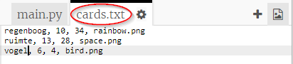
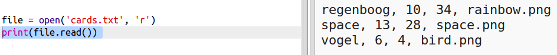
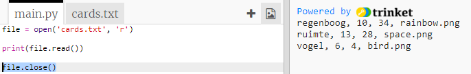
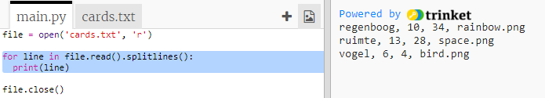
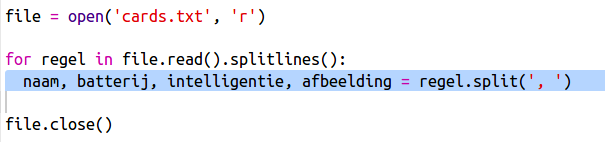
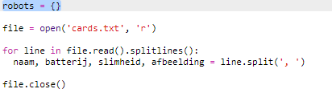
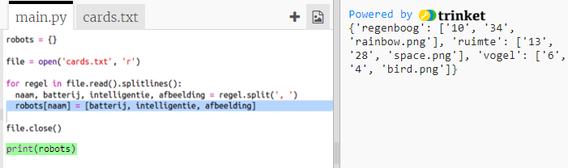

## Lees robotgegevens uit een bestand

Het is vaak handig om informatie uit een bestand te kunnen lezen. U kunt dan de gegevens in het bestand wijzigen zonder uw code te hoeven wijzigen.

+ Open deze trinket: <a href="http://jumpto.cc/trumps-go" target="_blank">jumpto.cc/trumps-go</a>.

+ Uw startersproject bevat een `cards.txt` bestand dat gegevens over robots bevat.
    
    Klik op `cards.txt` om de gegevens te bekijken:
    
    
    
    Elke regel bevat gegevens over een robot. De gegevensitems worden gescheiden door komma's.
    
    Elke regel bevat de volgende informatie:
    
    naam, intelligentiebeoordeling, hoe lang de batterij meegaat, naam van het beeldbestand

+ Laten we de gegevens in het bestand lezen zodat u het kunt gebruiken.
    
    De eerste stap is om het `cards.txt` bestand in uw script te openen:
    
    

+ Nu kunt u de gegevens uit het bestand lezen:
    
    

+ Je moet altijd een bestand sluiten als je ermee klaar bent:
    
    

+ Dat geeft ons het bestand als één reeks, je moet het opdelen in de afzonderlijke stukjes gegevens.
    
    Eerst kunt u het bestand opsplitsen in een lijst met regels:
    
    
    
    Bekijk de uitvoer zorgvuldig. Er zijn drie items in de lijst, elk is een regel uit het bestand.

+ Nu kunt u één voor één over die lijnen lopen
    
    

+ In plaats van de regels af te drukken, lees ze in bij variabelen:
    
    

+ U wilt deze gegevens later kunnen gebruiken om de waarden voor een bepaalde robot op te zoeken. Laten we de naam van de robot gebruiken als sleutel tot een woordenboek.
    
    Voeg een `-robotten` woordenboek toe:
    
    

+ Laten we nu een vermelding toevoegen aan het robotwoordenboek voor elke robot.
    
    De naam is de sleutel en de waarde is een lijst met gegevens voor die robot.
    
    Voeg de gemarkeerde code toe:
    
    
    
    U kunt `printrobots` verwijderen wanneer u uw script hebt getest.