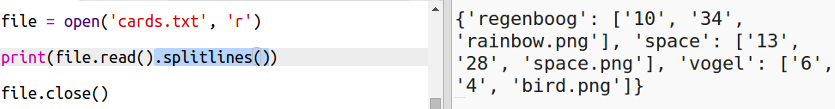
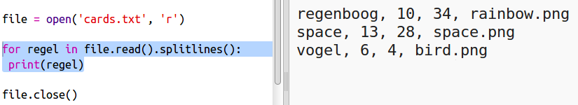
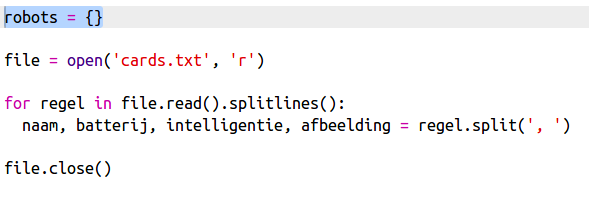

## Lees robotgegevens uit een bestand

Het is vaak handig om informatie uit een bestand te kunnen lezen. Je kunt dan de gegevens in het bestand wijzigen zonder de code te hoeven wijzigen.

+ Open deze trinket: <a href="http://jumpto.cc/trumps-go" target="_blank">jumpto.cc/trumps-go</a>.

+ Het startersproject bevat een bestand `cards.txt` dat gegevens over robots bevat.
    
    Klik op `cards.txt` om de gegevens te bekijken:
    
    
    
    Elke regel bevat gegevens over een robot. De onderdelen worden gescheiden door komma's.
    
    Elke regel bevat de volgende informatie:
    
    naam, intelligentiebeoordeling, hoe lang de batterij meegaat, naam van het beeldbestand

+ Laten we de gegevens in het bestand lezen zodat je het kunt gebruiken.
    
    De eerste stap is om het bestand `cards.txt` in het script te openen:
    
    

+ Nu kun je de gegevens uit het bestand lezen:
    
    

+ Je moet een bestand altijd sluiten als je ermee klaar bent:
    
    

+ Dat geeft ons het bestand als één regel, je moet het opdelen in afzonderlijke stukjes gegevens (Engels: data).
    
    Nu kun je het bestand opsplitsen in een lijst met regels:
    
    
    
    Bekijk de uitvoer zorgvuldig. Er staan drie voorwerpen in de lijst, elk is een regel uit het bestand.

+ Je kunt nu met een lus door alle regels lopen
    
    

+ In plaats van de regels weer te geven, worden ze in variabelen gestopt:
    
    

+ Deze gegevens wil je later kunnen gebruiken om de waarden voor een bepaalde robot op te zoeken. Laten we de naam van de robot gebruiken als sleutel tot een woordenboek.
    
    Voeg een `robots` woordenboek toe:
    
    

+ Laten we nu voor elke robot een vermelding toevoegen aan het robotwoordenboek.
    
    De naam is de sleutel en de waarde is een lijst met gegevens voor die robot.
    
    Voeg de gemarkeerde code toe:
    
    
    
    Je kunt `print robots` verwijderen als je het script hebt getest.