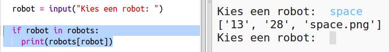
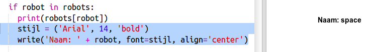
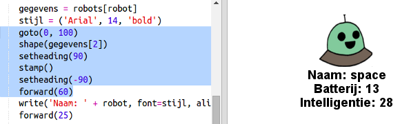

## Toon de gegevens

Nu kun je de robotgegevens op een interessantere manier weergeven.

Laten we een robottroefkaart weergeven met een afbeelding en gegevens over zijn intelligentie en bruikbaarheid.

Wanneer je deze stap hebt voltooid, kun je robots zoals deze weergeven:

+ Vraag de gebruiker welke robot ze graag zouden willen zien:
    
    

+ Als de robot in de lijst staat, zoek dan de gegevens op:
    
    
    
    Test je code door een robotnaam in te voeren.

+ Als de robot niet bestaat, geef dan een foutmelding:
    
    
    
    Test je code door een robotnaam in te voeren die niet in het woordenboek voorkomt.

+ Nu ga je de Python turtle gebruiken om de robotgegevens weer te geven.
    
    Importeer de turtle bliotheek bovenaan je script en stel het scherm en de turtle in:
    
    

+ Voeg nu code toe om de turtle de naam van de robot te laten weergeven:
    
    

+ Probeer de ` stijl` variabele aan te passen tot je tevreden bent met de tekst.
    
    In plaats van `Arial` zou je: `Courier`, `Times` of `Verdana` kunnen proberen.
    
    Wijzig `14` in een ander nummer om de lettergrootte te wijzigen.
    
    Je kunt `bold` in `normal` of `italic` veranderen.

+ Sla de lijst met robotgegevens op in een variabele in plaats van ze weer te geven:
    
    

+ Je hebt nu toegang tot de gegevens voor de robot in een lijst:
    
    + `gegevens[0]` is intelligentie
    + `gegevens[1]` is batterij
    + `gegevens[2]` is de naam van de afbeelding
    
    Voeg code toe om de intelligentie- en batterijgegevens weer te geven:
    
    

+ Oh jee! De gegevens staan allemaal door elkaar. Je moet code toevoegen om de turtle te verplaatsen:
    
    

+ En tot slot voegen we de robotafbeelding toe om het beeld af te maken.
    
    Je moet een regel toevoegen om de afbeelding te registreren wanneer je de gegevens leest van `cards.txt`:
    
    

+ En voeg code toe om de afbeelding te positioneren en te stempelen:
    
    

+ Test je code door één robot in te voeren en dan een andere en je zult zien dat ze over elkaar staan!
    
    Je moet het scherm leegmaken voordat je een robot weergeeft:
    
    