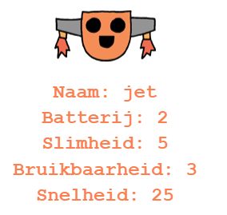

--- challenge ---

## Uitdaging: voeg meer gegevens toe aan de robots

Kun je nog meer gegevens bedenken die aan de robots kunnen worden toegevoegd? Je kunt 'snelheid' of 'bruikbaarheid' toevoegen of je eigen eigenschappen bedenken.

Je moet het volgende doen:

+ Voeg gegevens toe aan het bestand voor elke nieuwe categorie 
+ Voeg de nieuwe categorie toe aan de code die de gegevens leest
+ Geef de nieuwe categorie weer als je een troefkaart toont

Je kunt zelfs een kleur toevoegen om de robotgegevens een eigen kleur te geven.

Hint: gebruik `color('red')` om de tekst van de turtle rood te maken voor je gaat schrijven.

Voorbeeld:

--- /challenge ---