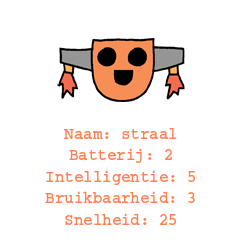

\--- challenge \---

## Uitdaging: voeg meer gegevens toe aan de robots

Kun je nog meer gegevens bedenken die aan de robots kunnen worden toegevoegd. Je kunt 'snelheid' of 'bruikbaarheid' toevoegen of je eigen eigenschappen bedenken.

Je moet het volgende doen:

+ Voeg gegevens voor elke nieuwe categorie toe aan het bestand 
+ Voeg de nieuwe categorie toe aan gegevens in de code die wordt ingelezen
+ Geef de nieuwe categorie weer wanneer je een troefkaart toont

Je kunt zelfs een kleur toevoegen en de statistieken voor robots in hun eigen kleur weergeven.

Hint: gebruik `color('red')` om de tekst van de schildpad rood te maken voordat je gaat schrijven.

Voorbeeld:

\--- /challenge \---