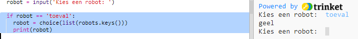

## Geef een willekeurige robot weer

We voegen code toe zodat je een willekeurige robot krijgt als je 'willekeurig' typt in plaats van een robotnaam.

+ Eerst moet je de choice functie uit de module random importeren:
    
    

+ Je kunt `choice` gebruiken om een ​​willekeurige robotnaam uit de lijst met sleutels van het robotwoordenboek te kiezen.
    
    

+ In Python 3 moet je `list` gebruiken om de resultaten van de `keys` in een lijst te krijgen.
    
    Tip: controleer zorgvuldig het gebruik van haakjes!