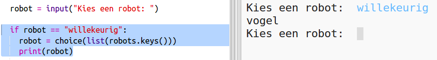

## Geef een willekeurige robot weer

Laten we code toevoegen zodat je een willekeurige robot krijgt als je random (willekeurig) in plaats van een robotnaam typt.

+ Eerst moet je de keuzefunctie uit de random module importeren:
    
    

+ U kunt `choice` gebruiken om een ​​willekeurige robotnaam uit de lijst met sleutels uit de robotlijst te kiezen.
    
    

+ In Python 3 moet je `list` gebruiken om de resultaten van de `keys` in een lijst te veranderen.
    
    Tip: controleer zorgvuldig het gebruik van haakjes!