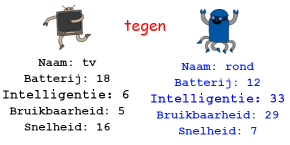

--- challenge ---

## Uitdaging: speel Robo-Troef met een vriend

Deel je project met een vriend en speel RoboTroef. Beiden moeten hetzelfde project gebruiken om het eerlijk te houden! Speler één vraagt ​​om een ​​willekeurige robot en kiest vervolgens een categorie. Speler 2 vraagt dan om een ​​willekeurige robot en je controleert wie de hoogste score heeft voor de gekozen categorie en dan wissel je.

Het spel werkt het beste als je allebei met hetzelfde spel kaarten speelt. Deel een link naar je trinket project met een vriend, zodat je allebei hetzelfde kaartspel kunt gebruiken.

--- /challenge ---
***
### Door de community geleverde vertaling 

Dit project werd vertaald door **Cor Groot** en gecontroleerd door **Henny van Ham**. 

Onze geweldige vertalers helpen ons om kinderen over de hele wereld de kans te geven te leren coderen. Jij kunt ons helpen nog meer kinderen te bereiken door onze projecten te vertalen - lees meer op [rpf.io/translators](https://rpf.io/translators).
