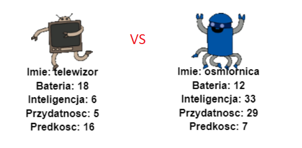

## Wprowadzenie

W tym projekcie odczytasz dane z pliku, aby utworzyć karty atutowe robota. Następnie możesz zagrać w Robo-Trumps z przyjacielem.

  <iframe src="https://trinket.io/embed/python/9ccc368bd5?outputOnly=true&start=result" width="600" height="500" frameborder="0" marginwidth="0" marginheight="0" allowfullscreen>
  </iframe>
  

### Dodatkowe informacje dla prowadzących klub

Jeśli chcesz wydrukować ten projekt, użyj [wersji do druku](https://projects.raspberrypi.org/pl-PL/projects/robo-trumps/print).

--- collapse ---
---
title: Notatki dla liderów klubów
---

## Wprowadzenie:

W tym projekcie uczniowie będą czytać dane z pliku do słownika, aby stworzyć karty atutowe robotów. Karty mogą być następnie używane do gry Robo-Trumps z przyjacielem.

## Zasoby Online

**Ten projekt używa języka Python 3.** Do pisania kodu w Pythonie zalecamy użycie edytora [trinket](https://trinket.io/). Ten projekt zawiera następujące Trinkety:

* [Punkt startowy "Robo-Trumps" - jumpto.cc/trumps-go](http://jumpto.cc/trumps-go)

Dostępny jest również Trinket zawierający przykładowe rozwiązanie dla wyzwań:

* [Zakończony "Robo-Trumps" - trinket.io/python/9ccc368bd5](https://trinket.io/python/9ccc368bd5)

## Zasoby Offline

Ten projekt można również [ukończyć bez dostępu do sieci](https://www.codeclubprojects.org/en-GB/resources/python-working-offline/). Materiały potrzebne do wykonania projektu dostępne są po kliknięciu linku "Materiały do projektu". Można znaleźć tam sekcję "Źródła Projektu", która zawiera zasoby, potrzebne dzieciom do wykonania projektu w wersji offline. Upewnij się, że każde dziecko ma dostęp do tych zasobów. Ta sekcja zawiera następujące pliki:

* robotrumps/robotrumps.py
* robotrumps/cards.txt
* Kilka obrazków robota w formacie .gif

Pełną wersję tego projektu można również znaleźć w sekcji "Zasoby dla wolontariuszy", która zawiera:

* robotrumps-finished/robotrumps.py
* robotrumps-finished/cards.txt
* Kilka obrazków robota w formacie .gif

(Wszystkie powyższe zasoby można również pobrać jako pliki `.zip`.)

## Cele dydaktyczne

* Konsolidacja: struktury danych, odczyt z pliku i grafika żółwia;
* Używanie obrazów w grafice żółwia;
* Udostępnianie projektów Trinket.

Projekt ten obejmuje elementy z następujących wątków [Cyfrowego programu nauczania Raspberry Pi](http://rpf.io/curriculum):

* [Połącz konstrukcje programistyczne, aby rozwiązać problem.](https://www.raspberrypi.org/curriculum/programming/builder)

## Wyzwania

* Dodaj więcej robotów - Edycja pliku .txt i praca z obrazami;
* Dodaj więcej statystyk do robotów - obsługa danych;
* Graj w Robo-Trumps z przyjacielem.

## Najczęściej Zadawane Pytania

* **Python offline nie działa z obrazkami w formacie .png. Pliki .gif zostały dostarczone do użytku w trybie offline.**
* Zwróć uwagę, że w tym projekcie używasz zarówno tekstu wejściowego, jak i grafiki żółwia, możesz dostosować ilość miejsca przydzielonego każdemu w trinket.
* Musisz kliknąć w oknie tekstowym Trinket przed wpisaniem.
* Dzieci mogą skorzystać z opcji "Udostępnij" w Trinket, aby uzyskać link do swojego projektu. Jeśli mają dostęp do poczty e-mail, mogą wysłać wiadomość e-mail z linkiem do znajomego, w przeciwnym razie mogą po prostu ją przeczytać, zapisać na kartce papieru lub zapisać w pliku tekstowym w sieci lokalnej.

--- /collapse ---

--- collapse ---
---
title: Materiały do projektu
---

## Zasoby Projektu

* [Plik .zip zawierający wszystkie zasoby projektu](resources/robo-trumps-project-resources.zip)
* [Trinket Online zawierający zasoby startowe "Robo-Trumps"](http://jumpto.cc/trumps-go)
* [robo-trumps/robo-trumps.py](resources/robo-trumps-robo-trumps.py)
* [robo-trumps/cards.txt](resources/robo-trumps-cards.txt)
* [robo-trumps/space.gif](resources/robo-trumps-space.gif)
* [robo-trumps/rainbow.gif](resources/robo-trumps-rainbow.gif)
* [robo-trumps/bird.gif](resources/robo-trumps-bird.gif)
* [robo-trumps/dog.gif](resources/robo-trumps-dog.gif)
* [robo-trumps/jet.gif](resources/robo-trumps-jet.gif)
* [robo-trumps/round.gif](resources/robo-trumps-round.gif)
* [robo-trumps/brains.gif](resources/robo-trumps-brains.gif)
* [robo-trumps/twoheads.gif](resources/robo-trumps-twoheads.gif)
* [robo-trumps/shades.gif](resources/robo-trumps-shades.gif)
* [robo-trumps/hair.gif](resources/robo-trumps-hair.gif)
* [robo-trumps/tv.gif](resources/robo-trumps-tv.gif)
* [robo-trumps/yellow.gif](resources/robo-trumps-yellow.gif)

## Zasoby dla lidera klubu

* [Plik .zip zawierający zasoby z ukończonym projektem](resources/robotrumps-volunteer-resources.zip)
* [Ukończony projekt online w Trinket](https://trinket.io/python/9ccc368bd5)
* [robo-trumps-finished/robo-trumps.py](resources/robo-trumps-finished-robo-trumps.py)
* [robo-trumps-finished/cards.txt](resources/robo-trumps-finished-cards.txt)
* [robo-trumps-finished/space.gif](resources/robo-trumps-finished-space.gif)
* [robo-trumps-finished/rainbow.gif](resources/robo-trumps-finished-rainbow.gif)
* [robo-trumps-finished/bird.gif](resources/robo-trumps-finished-bird.gif)
* [robo-trumps-finished/dog.gif](resources/robo-trumps-finished-dog.gif)
* [robo-trumps-finished/jet.gif](resources/robo-trumps-finished-jet.gif)
* [robo-trumps-finished/round.gif](resources/robo-trumps-finished-round.gif)
* [robo-trumps-finished/brains.gif](resources/robo-trumps-finished-brains.gif)
* [robo-trumps-finished/twoheads.gif](resources/robo-trumps-finished-twoheads.gif)
* [robo-trumps-finished/shades.gif](resources/robo-trumps-finished-shades.gif)
* [robo-trumps-finished/hair.gif](resources/robo-trumps-finished-hair.gif)
* [robo-trumps-finished/tv.gif](resources/robo-trumps-finished-tv.gif)
* [robo-trumps-finished/yellow.gif](resources/robo-trumps-finished-yellow.gif)

--- /collapse ---