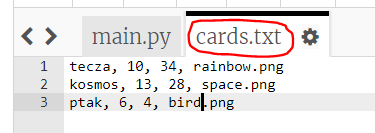
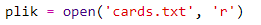
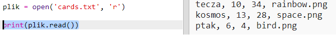
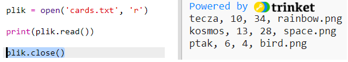
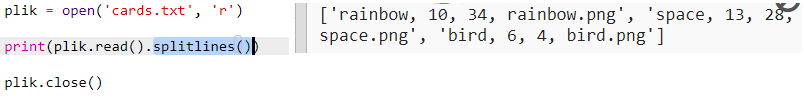
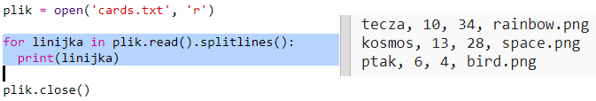
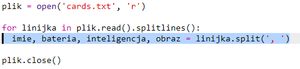
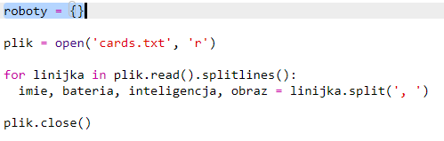
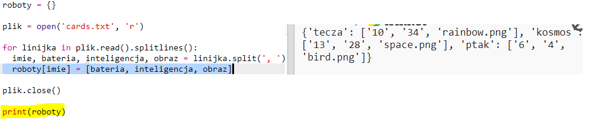

## Wczytaj dane robota z pliku

Często przydaje się możliwość odczytu informacji z pliku. Następnie możesz zmienić dane w pliku bez konieczności zmiany kodu.

+ Otwórz ten trinket: <a href="http://jumpto.cc/trumps-go" target="_blank">jumpto.cc/trumps-go</a>.

+ Twój projekt początkowy zawiera plik `cards.txt` zawierający dane o robotach.
    
    Kliknij `cards.txt`, aby wyświetlić dane:
    
    
    
    Każda linia zawiera dane o robocie. Elementy danych są oddzielone przecinkami.
    
    Każda linia zawiera następujące informacje:
    
    nazwa, ocena inteligencji, czas pracy baterii, nazwa pliku obrazu

+ Przeczytajmy dane z pliku, abyś mogła z niego korzystać.
    
    Pierwszym krokiem jest otwarcie pliku `cards.txt` w swoim skrypcie:
    
    

+ Teraz możesz odczytać dane z pliku:
    
    

+ Zawsze powinnaś zamknąć plik, po zakończeniu:
    
    

+ To daje nam plik jako jeden ciąg, musisz podzielić go na poszczególne fragmenty danych.
    
    Najpierw możesz podzielić plik na listę linii:
    
    
    
    Przyjrzyj się uważnie wynikowi. Na liście znajdują się trzy pozycje, z których każda jest linią z pliku.

+ Teraz możesz przełączać się po tych liniach pojedynczo
    
    

+ Zamiast drukować linie, wczytaj je do zmiennych:
    
    

+ Chcesz móc później wykorzystać te dane do wyszukiwania wartości dla konkretnego robota. Użyjmy nazwy robota jako klucza do słownika.
    
    Dodaj słownik `roboty`:
    
    

+ Dodajmy teraz pozycję do słownika robotów dla każdego robota.
    
    Nazwa jest kluczem, a wartość jest listą danych dla tego robota.
    
    Dodaj podświetlony kod:
    
    
    
    Możesz usunąć `drukuj roboty` po przetestowaniu skryptu.