## Wyświetl dane

Teraz możesz wyświetlać dane robota w bardziej interesujący sposób.

Pokażmy kartę atutową robota z obrazem i danymi, aby uzyskać informacje na temat jej inteligencji i użyteczności.

Po ukończeniu tego kroku będziesz mógł wyświetlać roboty w następujący sposób:

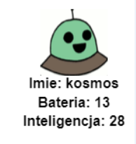

+ Zapytaj użytkownika, który robot chciałby zobaczyć:
    
    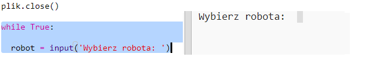

+ Jeśli robot znajduje się w słowniku, sprawdź jego dane:
    
    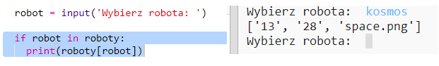
    
    Przetestuj swój kod, wpisując nazwę robota.

+ Jeśli robot nie istnieje, to daj błąd:
    
    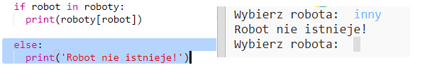
    
    Przetestuj swój kod, wprowadzając nazwę robota, której nie ma w słowniku.

+ Teraz będziesz używał żółwia Python do wyświetlania danych robota.
    
    Zaimportuj bibliotekę żółwich u góry skryptu i ustaw ekran i żółwia:
    
    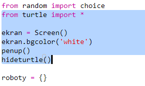

+ Teraz dodaj kod, aby żółw wydrukował nazwę robota:
    
    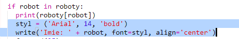

+ Spróbuj zmienić zmienną `w stylu` , dopóki nie będziesz zadowolony z tekstu.
    
    Zamiast `Arial` możesz spróbować: `Kurier`, `Czasy` lub `Verdana`.
    
    Zmień `14` na inną liczbę, aby zmienić rozmiar czcionki.
    
    Możesz zmienić `pogrubiony` na `normalny` lub `kursywę`.

+ Przechowuj listę statystyk robota w zmiennej zamiast ich drukowania:
    
    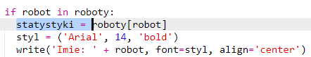

+ Teraz możesz uzyskać dostęp do statystyk robota jako elementów na liście:
    
    + `statystyki[0]` to inteligencja
    + `statystyki[1]` jest bateria
    + `statystyki[2]` to nazwa obrazu
    
    Dodaj kod, aby wyświetlić statystyki dotyczące inteligencji i baterii:
    
    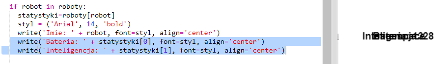

+ O jej! Statystyki są umieszczone jeden na drugim. Aby przenieść żółwia, musisz dodać kod:
    
    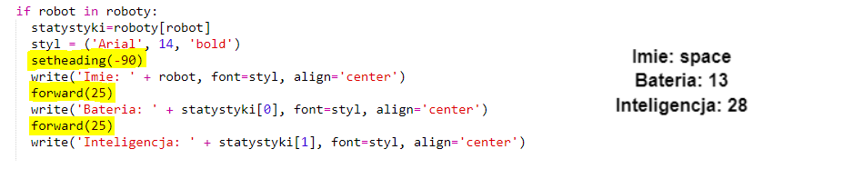

+ Na koniec dodajmy obraz robota, aby ukończyć wyświetlanie.
    
    Będziesz musiał dodać linię, aby zarejestrować obraz po przeczytaniu danych z `cards.txt`:
    
    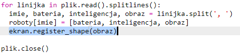

+ I dodaj kod do położenia i stempla obrazu:
    
    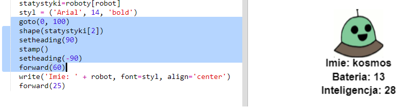

+ Przetestuj swój kod, wprowadzając jednego robota, a potem drugiego, a zobaczysz, że wyświetlają się jeden na drugim!
    
    Musisz wyczyścić ekran przed wyświetleniem robota:
    
    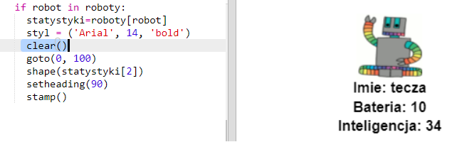