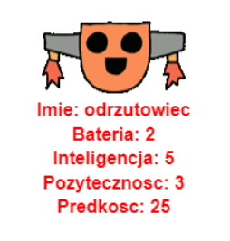

\--- challenge \---

## Challenge: Add more stats to the robots

Can you think of more stats to add to the robots. You could add ‘speed’ or ‘usefulness’ or come up with your own ideas.

You’ll need to:

+ Add data to the file for each new category 
+ Add the new category to the code that read in the data
+ Write the new category out when you display a trump card

You could even add a colour and show the stats for robots in their own color.

Hint: Use `color('red')` to change the turtle's text to red before writing.

Example:

\--- /challenge \---