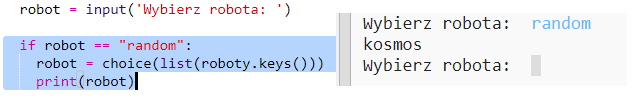

## Wyświetl losowego robota

Dodajmy kod, aby otrzymać losowego robota po wpisaniu Random zamiast nazwy robota.

+ Najpierw musisz zaimportować funkcję choice z biblioteki random:
    
    

+ Możesz użyć `choice`, aby wybrać losową nazwę robota z listy kluczy ze słownika z robotami.
    
    

+ W Pythonie 3 musisz użyć obiektu `list`, aby zamienić wyniki kluczy słownika `keys` w listę.
    
    Wskazówka: pamiętaj o dokładnym sprawdzeniu nawiasów!