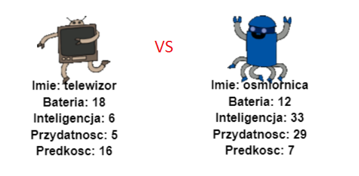

--- challenge ---

## Wyzwanie: zagraj w Robo-Trumps z przyjacielem

Udostępnij swój projekt znajomym i zagraj w Robotrumps. Oboje używajcie tego samego projektu, aby było sprawiedliwie! Pierwszy gracz prosi o losowego robota, a następnie wybiera kategorię. Drugi gracz następnie prosi o losowego robota i sprawdza, kto ma najwyższy wynik dla wybranej kategorii, a następuje zamiana.

Gra działa najlepiej, jeśli obaj gracie z tą samą talią kart. Udostępnij znajomym link do projektu trinket, aby móc korzystać z tej samej talii.

--- /challenge ---

***

Ten projekt został przetłumaczony przez wolontariuszy:

Marek Lubinski
Szymon Olesiński
Kacper Bober

Dzięki wolontariuszom możemy dać ludziom na całym świecie szansę nauki w ich własnym języku. Możesz pomóc nam dotrzeć do większej liczby osób, zgłaszając się na ochotnika do tłumaczenia - więcej informacji na stronie [rpf.io/translate](https://rpf.io/translate).