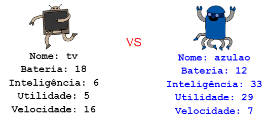

## Introdução

Neste projeto, você vai ler os dados de um arquivo para criar um jogo de cartas trunfo de robôs. Então você poderá jogar Robô-Trunfo com um amigo.

  <iframe src="https://trinket.io/embed/python/9ccc368bd5?outputOnly=true&start=result" width="600" height="500" frameborder="0" marginwidth="0" marginheight="0" allowfullscreen>
  </iframe>
  

### Informação adicional para os líderes dos clubes

Se você precisar imprimir este projeto, use a [versão para impressão](https://projects.raspberrypi.org/en/projects/robo-trumps/print).

## \--- collapse \---

## título: Notas do líder do clube

## Introdução:

Neste projeto, os alunos lerão os dados de um arquivo em um dicionário, para as cartas trunfo dos robôs. As cartas podem então ser usados ​​para jogar Robô-Trunfo com um amigo.

## Recursos online

**Este projeto usa o Python 3.** Recomendamos usar o [trinket](https://trinket.io/) para programar em Python online. Este projeto contém os seguintes Trinkets:

* [Ponto de partida 'Robô-Trunfo' - jumpto.cc/trumps-go](http://jumpto.cc/trumps-go)

Há também um trinket contendo uma solução de amostra para os desafios:

* ['Robô-Trunfo' concluído - trinket.io/python/9ccc368bd5](https://trinket.io/python/9ccc368bd5)

## Recursos offline

Este projeto pode ser [concluído off-line](https://www.codeclubprojects.org/en-GB/resources/python-working-offline/) , se preferir. Você pode acessar os recursos do projeto clicando no link 'Materiais do Projeto' para este projeto. Este link contém uma seção "Recursos do Projeto", que inclui recursos que as crianças precisarão para concluir esse projeto off-line. Certifique-se de que cada criança tenha acesso a uma cópia desses recursos. Esta seção inclui os seguintes arquivos:

* robotrumps/robotrumps.py
* robotrumps/cards.txt
* Várias imagens .gif dos robôs

Você também pode encontrar uma versão completa dos desafios deste projeto na seção "Recursos para Voluntários", que contém:

* robotrumps-finished/robotrumps.py
* robotrumps-finished/cards.txt
* Várias imagens .gif dos robôs

(Todos os recursos acima também podem ser baixados como arquivos `.zip`.)

## Objetivos de Aprendizado

* Consolidação: estruturas de dados, leitura de dados a partir de arquivos externos e 'turtle graphics';
* Usar imagens no módulo 'turtle graphics';
* Compartilhar projetos no trinket.

Este projeto abrange elementos das seguintes vertentes do [Currículo de Criação Digital do Raspberry Pi](http://rpf.io/curriculum):

* [Combine construções de programação para resolver um problema.](https://www.raspberrypi.org/curriculum/programming/builder)

## Desafios

* Adicione mais robôs - Editando um arquivo .txt e trabalhando com imagens;
* Adicione mais informações aos robôs - manipulando dados;
* Jogue Robô-Trunfo com um amigo.

## Perguntas Frequentes

* **O Python off-line não funciona com imagens .png. Imagens .gif foram fornecidas para uso off-line.**
* Observe que este projeto usa entrada de texto e 'turtle graphics', você pode ajustar a quantidade de espaço de cada um no trinket.
* Você precisa clicar na janela de texto do trinket antes de digitar.
* As crianças podem usar a opção "Compartilhar" no trinket para obter um link para o projeto. Se eles tiverem acesso ao e-mail, eles poderão enviar o link por e-mail a um amigo, caso contrário, ele poderá lê-lo, anotá-lo em um pedaço de papel ou salvá-lo em um arquivo de texto na rede local.

\--- /collapse \---

## \--- collapse \---

## Título: Materiais do projeto

## Recursos do projeto

* [arquivo .zip contendo todos os recursos do projeto](resources/robo-trumps-project-resources.zip)
* [Trinket Online contendo recursos iniciais do 'Robô-Trunfo'](http://jumpto.cc/trumps-go)
* [robo-trumps/robo-trumps.py](resources/robo-trumps-robo-trumps.py)
* [robo-trumps/cards.txt](resources/robo-trumps-cards.txt)
* [robo-trumps/space.gif](resources/robo-trumps-space.gif)
* [robo-trumps/rainbow.gif](resources/robo-trumps-rainbow.gif)
* [robo-trumps/bird.gif](resources/robo-trumps-bird.gif)
* [robo-trumps/dog.gif](resources/robo-trumps-dog.gif)
* [robo-trumps/jet.gif](resources/robo-trumps-jet.gif)
* [robo-trumps/round.gif](resources/robo-trumps-round.gif)
* [robo-trumps/brains.gif](resources/robo-trumps-brains.gif)
* [robo-trumps/twoheads.gif](resources/robo-trumps-twoheads.gif)
* [robo-trumps/shades.gif](resources/robo-trumps-shades.gif)
* [robo-trumps/hair.gif](resources/robo-trumps-hair.gif)
* [robo-trumps/tv.gif](resources/robo-trumps-tv.gif)
* [robo-trumps/yellow.gif](resources/robo-trumps-yellow.gif)

## Recursos do líder do clube

* [arquivo .zip contendo todos os recursos do projeto concluídos](resources/robotrumps-volunteer-resources.zip)
* [Projeto Trinket concluído online](https://trinket.io/python/9ccc368bd5)
* [robo-trumps-finished/robo-trumps.py](resources/robo-trumps-finished-robo-trumps.py)
* [robo-trumps-finished/cards.txt](resources/robo-trumps-finished-cards.txt)
* [robo-trumps-finished/space.gif](resources/robo-trumps-finished-space.gif)
* [robo-trumps-finished/rainbow.gif](resources/robo-trumps-finished-rainbow.gif)
* [robo-trumps-finished/bird.gif](resources/robo-trumps-finished-bird.gif)
* [robo-trumps-finished/dog.gif](resources/robo-trumps-finished-dog.gif)
* [robo-trumps-finished/jet.gif](resources/robo-trumps-finished-jet.gif)
* [robo-trumps-finished/round.gif](resources/robo-trumps-finished-round.gif)
* [robo-trumps-finished/brains.gif](resources/robo-trumps-finished-brains.gif)
* [robo-trumps-finished/twoheads.gif](resources/robo-trumps-finished-twoheads.gif)
* [robo-trumps-finished/shades.gif](resources/robo-trumps-finished-shades.gif)
* [robo-trumps-finished/hair.gif](resources/robo-trumps-finished-hair.gif)
* [robo-trumps-finished/tv.gif](resources/robo-trumps-finished-tv.gif)
* [robo-trumps-finished/yellow.gif](resources/robo-trumps-finished-yellow.gif)

\--- /collapse \---