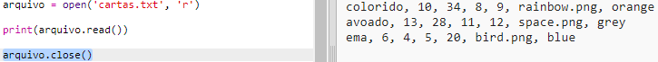

## Ler dados do robô de um arquivo

Geralmente é útil poder ler informações de um arquivo. Você pode alterar os dados no arquivo sem precisar alterar seu código.

+ Abra este trinket: <a href="http://jumpto.cc/trumps-go" target="_blank">jumpto.cc/trumps-go</a>.

+ Seu projeto inicial inclui um arquivo `cards.txt` que contém dados sobre robôs.
    
    Clique em `cards.txt` para ver os dados:
    
    
    
    Cada linha tem dados sobre um robô. Os itens de dados são separados por vírgulas.
    
    Cada linha contém as seguintes informações:
    
    nome, classificação de inteligência, quanto tempo dura a bateria, nome do arquivo de imagem

+ Vamos ler os dados do arquivo para que você possa usá-lo.
    
    O primeiro passo é abrir o arquivo `cards.txt` no seu script:
    
    

+ Agora você pode ler os dados do arquivo:
    
    

+ Você deve sempre fechar um arquivo quando terminar:
    
    

+ Isso nos dá o arquivo como uma string, você precisa dividi-lo em partes individuais de dados.
    
    Primeiro, você pode dividir o arquivo em uma lista de linhas:
    
    
    
    Olhe atentamente para a saída. Existem três itens na lista, cada um é uma linha do arquivo.

+ Agora você pode passar por cima dessas linhas uma de cada vez
    
    

+ Em vez de imprimir as linhas, leia-as para as variáveis:
    
    

+ Você quer poder usar esses dados mais tarde para procurar os valores de um determinado robô. Vamos usar o nome do robô como chave para um dicionário.
    
    Adicione um `robôs` dicionário:
    
    

+ Agora vamos adicionar uma entrada ao dicionário de robôs para cada robô.
    
    O nome é a chave e o valor é uma lista de dados para esse robô.
    
    Adicione o código destacado:
    
    
    
    Você pode remover os `robôs de impressão` quando testar seu script.