## Exibir os dados

Agora você pode exibir os infomarções do robô de uma maneira mais interessante.

Vamos exibir uma carta do Robô-Trunfo com uma imagem e as informações de inteligência e bateria.

Quando você concluir essa etapa, poderá exibir robôs como este:

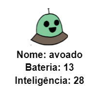

+ Pergunte ao usuário qual robô eles gostariam de ver:
    
    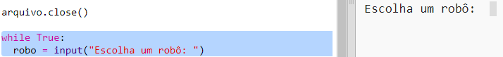

+ Se o robô estiver no dicionário, pesquise seus dados:
    
    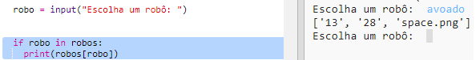
    
    Teste seu código digitando o nome de um robô.

+ Se o robô não existir, aparecerá uma mensagem de erro:
    
    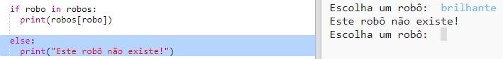
    
    Teste seu código digitando o nome de um robô que não esteja no dicionário.

+ Agora você vai usar a turtle (tartaruga) no Python para exibir as informações do robô.
    
    Importe a biblioteca turtle no topo do seu script e configure a tela e a turtle(tartaruga):
    
    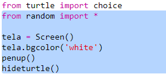

+ Agora adicione o código para que a tartaruga imprima o nome do robô:
    
    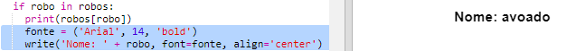

+ Tente alterar a variável `style` até que você esteja satisfeito com o texto.

    Em vez de `Arial` você poderia tentar: `Courier`, `Times` ou `Verdana`.
    
    Para alterar o tamanho da fonte, altere de `14` para um número diferente.
    
    Você pode alterar o texto para `bold (negrito)` para `normal` ou `italic (itálico)`.

+ Armazene a lista de informações do robô em uma variável em vez de imprimi-las:
    
    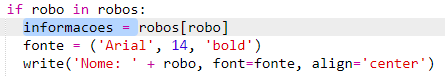

+ Agora você pode acessar as informações do robô como itens em uma lista:
    
    + `informacoes[0]` é a inteligência
    + `informacoes[1]` é a bateria
    + `informacoes[2]` é o nome da imagem
    
    Adicione o código para exibir as informações de inteligência e bateria:
    
    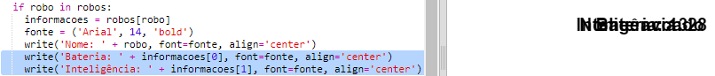

+ Oh céus! As informações estão todas em cima umas das outras. Você precisará adicionar código para mover a turtle (tartaruga):
    
    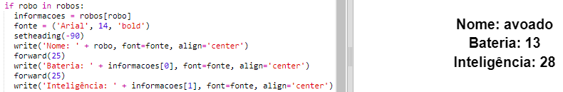

+ E finalmente, vamos adicionar a imagem do robô para completar a exibição.
    
    Você precisará adicionar uma linha para registrar a imagem ao ler os dados do `cartas.txt`:
    
    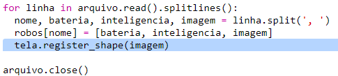

+ E adicione o código para posicionar e mostrar a imagem:
    
    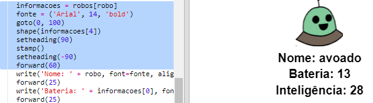

+ Teste seu código digitando um robô e depois outro e você verá que eles são exibidos um em cima do outro!
    
    Você precisa limpar a tela antes de exibir um robô:
    
    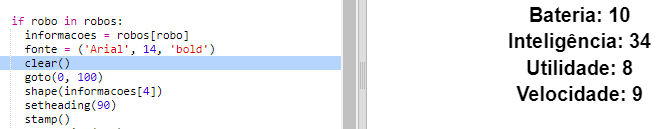