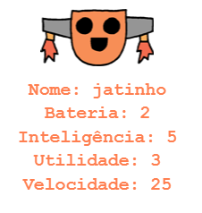

\--- desafio \---

## Desafio: adicione mais estatísticas aos robôs

Você pode pensar em mais estatísticas para adicionar aos robôs? Você pode adicionar "velocidade" ou "utilidade" ou criar suas próprias ideias.

Você precisará:

+ Adicione dados ao arquivo para cada nova categoria 
+ Adicione a nova categoria ao código que lê os dados
+ Escreva a nova categoria quando você exibir um trunfo

Você pode até adicionar uma cor e mostrar as estatísticas dos robôs em suas próprias cores.

Dica: Use `cores ('vermelho')` para mudar o texto da tartaruga para vermelho antes de escrever.

Exemplo:

\--- / desafio \---