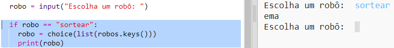

## Exibir um robô aleatório

Vamos adicionar código para que você obtenha um robô aleatório ao digitar Aleatório em vez de um nome de robô.

+ Primeiro você precisa importar a função de escolha do módulo aleatório:
    
    

+ Você pode usar `escolha` para escolher um nome de robô aleatório na lista de chaves do dicionário do robô.
    
    

+ No Python 3, você precisa usar a `lista` para transformar os resultados das `chaves` em uma lista.
    
    Dica: verifique cuidadosamente seus suportes!