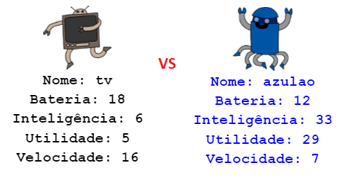

--- challenge ---

## Desafio: Jogue Robô-Trunfo com um amigo

Compartilhe o seu projeto com um amigo e jogue Robô-Trunfo. Ambos usarão o mesmo projeto para que seja justo! O jogador um solicita um robô aleatório e escolhe uma categoria. O jogador 2 pede então um robô aleatório e você verifica quem tem a pontuação mais alta para a categoria escolhida e depois troca.

O jogo funciona melhor se ambos jogarem com o mesmo baralho de cartas. Compartilhe o link para o seu projeto de trinket com um amigo para que você possa usar o mesmo baralho.

--- /challenge ---
***
### Tradução Contribuída pela Comunidade 

Este projeto foi traduzido por **Valdecir Neumann** e revisado por **Elton Marques**. 

Nossos incríveis voluntários de tradução nos ajudam a dar as crianças em todo o mundo a oportunidade de aprender a programar. Você pode nos ajudar a alcançar mais crianças traduzindo nossos projetos - leia mais em [rpf.io/translators](https://rpf.io/translators).
