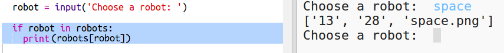

## Exibir os dados

Agora você pode exibir os dados do robô de uma maneira mais interessante.

Vamos exibir um trunfo robótico com uma imagem e dados para sua inteligência e utilidade.

Quando você concluir essa etapa, poderá exibir robôs como este:

+ Pergunte ao usuário qual robô eles gostariam de ver:
    
    

+ Se o robô estiver no dicionário, pesquise seus dados:
    
    
    
    Teste seu código digitando um nome de robô.

+ Se o robô não existir, dê um erro:
    
    
    
    Teste seu código digitando um nome de robô que não esteja no dicionário.

+ Agora você vai usar a tartaruga Python para exibir os dados do robô.
    
    Importe a biblioteca de tartarugas no topo do seu script e configure a tela e a tartaruga:
    
    

+ Agora adicione o código para que a tartaruga imprima o nome do robô:
    
    

+ Tente alterar a variável</code> do estilo `até que você esteja satisfeito com o texto.

Em vez de <code>Arial` você poderia tentar: `Courier`, `Horários` ou `Verdana`.
    
    Altere `14` para um número diferente para alterar o tamanho da fonte.
    
    Você pode alterar `negrito` para `normal` ou `itálico`.

+ Armazene a lista de estatísticas do robô em uma variável em vez de imprimi-las:
    
    

+ Agora você pode acessar as estatísticas do robô como itens em uma lista:
    
    + `estatísticas[0]` é inteligência
    + `stats[1]` é bateria
    + `stats[2]` é o nome da imagem
    
    Adicione o código para exibir as estatísticas de inteligência e bateria:
    
    

+ Oh céus! As estatísticas estão todas em cima umas das outras. Você precisará adicionar código para mover a tartaruga:
    
    

+ E finalmente, vamos adicionar a imagem do robô para completar a exibição.
    
    Você precisará adicionar uma linha para registrar a imagem ao ler os dados de `cards.txt`:
    
    

+ E adicione o código para posicionar e carimbar a imagem:
    
    

+ Teste seu código digitando um robô e depois outro e você verá que eles são exibidos um em cima do outro!
    
    Você precisa limpar a tela antes de exibir um robô:
    
    