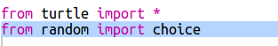

## Показать случайного робота

Давай добавим код, чтобы создался случайный робот, когда введено Random вместо имени робота.

+ Для начала вам нужно импортировать функцию выбора из случайного модуля:
    
    

+ Вы можете использовать `choice`, чтобы выбрать случайное имя робота из списка ключей из словаря робота.
    
    

+ В Python 3 вам нужно использовать `list`, чтобы превратить результаты `ключей` в список.
    
    Совет: убедитесь, что вы внимательно проверяете скобки!