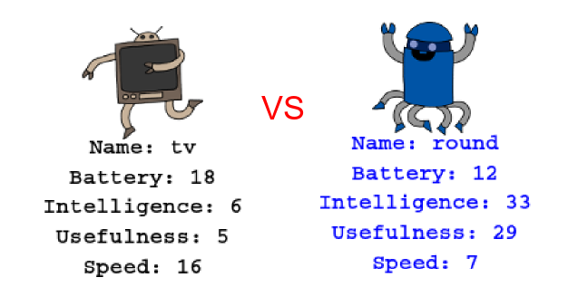

\--- challenge \---

## Испытание: Поиграйте в Robot-Trumps с другом

Поделитесь вашим проектом с другом и играйте в Robotrumps. Чтобы было справедливо, используйте вдвоём один и тот же проект! Первый игрок запрашивает случайного робота, а затем выбирает категорию. Затем второй игрок запрашивает случайного робота и проверяет, кто имеет наивысший балл в выбранной категории, а затем игроки меняются местами.

Игра работает лучше всего, если вы оба играете с одной колодой карт. Поделитесь ссылкой на ваш проект с другом, чтобы вы оба могли использовать ту же колоду.

\--- /challenge \---