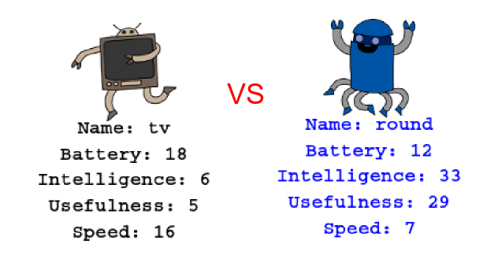

## Вступ

У цьому проекті ви будете читати дані з файлу, щоб створити робочі козирні картки. Тоді ви можете грати Robo-Trumps з другом.

  <iframe src="https://trinket.io/embed/python/9ccc368bd5?outputOnly=true&start=result" width="600" height="500" frameborder="0" marginwidth="0" marginheight="0" allowfullscreen>
  </iframe>
  

### Додаткова інформація для лідерів клубу

Якщо вам потрібно надрукувати цей проект, скористайтеся [Версія для друку](https://projects.raspberrypi.org/en/projects/robo-trumps/print).

## \--- колапс \---

## title: Керівник клубу відзначає

## Введення:

У цьому проекті учням буде зчитувати дані з файлу в словник, створити робочі козирні картки. Карти можуть бути використані для гри Robo-Trumps з другом.

## Інтернет-ресурси

**Цей проект використовує Python 3.** Ми рекомендуємо використовувати [trinket](https://trinket.io/) для написання Python в Інтернеті. Цей проект містить наступні брелки:

* [Відправна точка 'Robotrumps' - jumpto.cc/trumps -go](http://jumpto.cc/trumps-go)

Існує також дрібничок, що містить вибіркове рішення для вирішення проблем:

* ['Robotrumps' завершено - trinket.io/python/9ccc368bd5](https://trinket.io/python/9ccc368bd5)

## Офісні ресурси

Цей проект може бути [завершений автономно](https://www.codeclubprojects.org/en-GB/resources/python-working-offline/) , якщо воно є бажаним. Ви можете отримати доступ до ресурсів проекту, натиснувши посилання "Матеріали проекту" для цього проекту. Це посилання містить розділ "Ресурси проекту", який включає в себе ресурси, необхідні для завершення цього проекту в режимі офлайн. Переконайтеся, що кожна дитина має доступ до копії цих ресурсів. Цей розділ містить наступні файли:

* robotrumps / robotrumps.py
* robotrumps / cards.txt
* Кілька роботів .gif-зображень

Ви також можете знайти завершену версію викликів цього проекту у розділі "Ресурси волонтерів", яка містить:

* robotrumps-finished / robotrumps.py
* robotrumps-finished / cards.txt
* Кілька роботів .gif-зображень

(Всі вищезазначені ресурси також можна завантажувати як проекти та добровільні `.zip` файли.)

## Мета навчання

* Консолідація: структури даних, читання з графіки файлів і черепах;
* Використання зображень у черепахової графіці;
* Спільне використання брелоків проектів.

Цей проект охоплює елементи з наступних напрямків програми [Малярка Пі-Бі-Сі.](http://rpf.io/curriculum):

* [Об'єднати конструктор програмування для вирішення проблеми.](https://www.raspberrypi.org/curriculum/programming/builder)

## Виклики

* Додати більше роботів - редагування файлу .txt та роботи з зображеннями;
* Додайте більше статистичних даних роботам - обробка даних;
* Грати в Robotrumps зі своїм другом.

## Питання що часто задаються

* **Offline Python не працює з зображеннями .png. .gif зображення були надані для використання в автономному режимі.**
* Зауважте, що в цьому проекті використовуються як текстові введення, так і малюнки черепаху, ви можете налаштувати кількість вільного простору, наданого кожному в дрібничку.
* Потрібно натиснути в текстовому вікні брелока перед введенням тексту.
* Діти можуть використовувати параметр "Поділитися" в брелоку, щоб отримати посилання на свій проект. Якщо вони мають доступ до електронної пошти, вони можуть надіслати електронне повідомлення на адресу друзям, інакше вони можуть просто прочитати його, помітити його на папері або зберегти його в текстовому файлі в локальній мережі.

\--- / колапс \---

## \--- колапс \---

## title: Проектні матеріали

## Ресурси проекту

* [.zip-файл, що містить всі ресурси проекту](resources/robo-trumps-project-resources.zip)
* [Інтернет-брелок з ресурсами для початківців "Robo-Trumps"](http://jumpto.cc/trumps-go)
* [robo-trumps / robo-trumps.py](resources/robo-trumps-robo-trumps.py)
* [robo-trumps / cards.txt](resources/robo-trumps-cards.txt)
* [робо-козирі / space.gif](resources/robo-trumps-space.gif)
* [робо-козирі / rainbow.gif](resources/robo-trumps-rainbow.gif)
* [робо-козирі / bird.gif](resources/robo-trumps-bird.gif)
* [робо-козирі / dog.gif](resources/robo-trumps-dog.gif)
* [робо-козирі / jet.gif](resources/robo-trumps-jet.gif)
* [робо-козирі / round.gif](resources/robo-trumps-round.gif)
* [робо-козирі / brains.gif](resources/robo-trumps-brains.gif)
* [робо-козирі / twoheads.gif](resources/robo-trumps-twoheads.gif)
* [робо-козирі / shades.gif](resources/robo-trumps-shades.gif)
* [робо-козирі / hair.gif](resources/robo-trumps-hair.gif)
* [робо-козирі / tv.gif](resources/robo-trumps-tv.gif)
* [робо-козирі / yellow.gif](resources/robo-trumps-yellow.gif)

## Керівник ресурсів Клубу

* [.zip-файл, що містить всі завершені ресурси проекту](resources/robotrumps-volunteer-resources.zip)
* [Онлайн завершив проект "Брелок"](https://trinket.io/python/9ccc368bd5)
* [робо-козирі-готові / robo-trumps.py](resources/robo-trumps-finished-robo-trumps.py)
* [робо-козирі-готові / cards.txt](resources/robo-trumps-finished-cards.txt)
* [робо-козирі-готові / space.gif](resources/robo-trumps-finished-space.gif)
* [робо-козирі-готові / rainbow.gif](resources/robo-trumps-finished-rainbow.gif)
* [Робо-козирі-закінчені / bird.gif](resources/robo-trumps-finished-bird.gif)
* [робо-козирі-готові / dog.gif](resources/robo-trumps-finished-dog.gif)
* [робо-козирі-готові / jet.gif](resources/robo-trumps-finished-jet.gif)
* [робо-козирі-готові / round.gif](resources/robo-trumps-finished-round.gif)
* [Робо-козирі-готові / brains.gif](resources/robo-trumps-finished-brains.gif)
* [робо-козирі-закінчені / twoheads.gif](resources/robo-trumps-finished-twoheads.gif)
* [робо-козирі-готові / shades.gif](resources/robo-trumps-finished-shades.gif)
* [robo-trumps-finished / hair.gif](resources/robo-trumps-finished-hair.gif)
* [Робо-козирі-готові / tv.gif](resources/robo-trumps-finished-tv.gif)
* [робо-козирі-готово / yellow.gif](resources/robo-trumps-finished-yellow.gif)

\--- / колапс \---