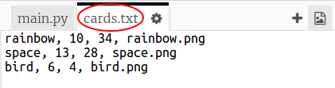

## Читайте дані робота з файлу

Часто корисно вміти читати інформацію з файлу. Після цього ви можете змінити дані у файлі без зміни коду.

+ Відкрийте цю дрібничку: <a href="http://jumpto.cc/trumps-go" target="_blank">jumpto.cc/trumps-go</a>.

+ Ваш стартовий проект містить `файл files.txt` , який містить дані про роботів.
    
    Натисніть `maps.txt` , щоб переглянути дані:
    
    
    
    Кожен рядок містить дані про робота. Елементи даних розділені комами.
    
    Кожен рядок містить таку інформацію:
    
    ім'я, рейтинг розвідки, тривалість роботи акумулятора, назва файлу зображення

+ Давайте читаємо дані з файлу, щоб ви могли його використовувати.
    
    Першим кроком буде відкрити файл `cards.txt` у вашому сценарії:
    
    

+ Тепер ви можете прочитати дані з файлу:
    
    

+ Ви завжди повинні закрити файл, коли ви закінчите з ним:
    
    

+ Це дає нам файл як один рядок, потрібно розбити його на окремі фрагменти даних.
    
    По-перше, ви можете розділити файл на список рядків:
    
    
    
    Подивіться уважно на виході. У списку є три пункти, кожна з яких - це рядок з файлу.

+ Тепер ви можете цикл по цих лініях по одному за раз
    
    

+ Замість того, щоб друкувати рядки, прочитайте їх у змінні:
    
    

+ Ви хочете мати можливість використовувати ці дані пізніше, щоб переглянути значення для певного робота. Давайте використовувати ім'я робота як ключ до словника.
    
    Додайте `робот` словник:
    
    

+ Тепер давайте додамо запис у словник роботів для кожного робота.
    
    Ім'я - це ключ, а значення - це список даних для цього робота.
    
    Додати виділений код:
    
    
    
    Ви можете видалити `друкованих роботів` , коли ви перевірили свій сценарій.