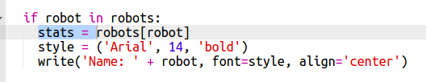

## Відображення даних

Тепер ви можете відображати дані робота більш цікавим способом.

Покажімо робочу козирну карту з зображенням та даними для її інтелекту та корисності.

Коли ви виконаєте цей крок, ви зможете показувати такі роботи:

+ Попросіть користувача, якого робота вони хотіли б побачити:
    
    

+ Якщо робот знаходиться в словнику, то знайдіть його дані:
    
    
    
    Перевірте свій код, ввівши ім'я робота.

+ Якщо робота не існує, дайте помилку:
    
    
    
    Перевірте свій код, ввівши ім'я робота, яке відсутнє в словнику.

+ Тепер ви збираєтеся використовувати черепаху Python, щоб відобразити дані робота.
    
    Імпортуйте бібліотеку черепаху у верхній частині вашого скрипту та встановіть екран та черепаху:
    
    

+ Тепер додайте код, щоб черепаха друкувала ім'я робота:
    
    

+ Спробуйте змінити `стиль` змінного, поки ви не задоволені текстом.
    
    Замість `Arial` можна спробувати: `Courier`, `Times` або `Verdana`.
    
    Змініть `14` на інше число, щоб змінити розмір шрифту.
    
    Ви можете змінити `напівжирний` на `звичайний` або `курсив`.

+ Зберігайте список статистичних даних робота в змінній, а не друкуйте їх:
    
    

+ Тепер ви можете отримати доступ до статистики робота як елементи списку:
    
    + `статистика[0]` інтелект
    + `статистика[1]` - це акумулятор
    + `статистика[2]` це ім'я зображення
    
    Додайте код, щоб відобразити дані про інтелект та акумулятор:
    
    

+ О Боже! Статистика - все на вершині один одного. Вам потрібно буде додати код для переміщення черепахи:
    
    

+ І, нарешті, давайте додамо зображення робота для завершення відображення.
    
    Вам потрібно буде додати рядок для реєстрації зображення, коли ви читаєте дані з `cards.txt`:
    
    

+ І додати код до позиції та штампувати зображення:
    
    

+ Перевірте свій код, ввівши одного робота, а потім іншого, і ви побачите, що вони відображаються на вершині один одного!
    
    Перед виведенням робота потрібно очистити екран:
    
    