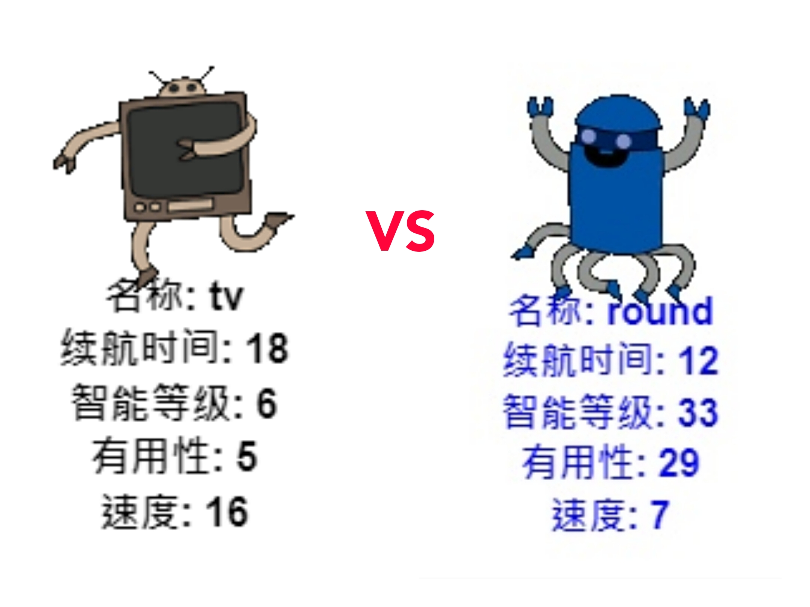

## 介绍

在这个项目中你将会通过从文件中读取数据来创建机器人王牌。 然后与朋友一起进行机器人王牌游戏。

  <iframe src="https://trinket.io/embed/python/3d840438cd?outputOnly=true&start=result" width="600" height="500" frameborder="0" marginwidth="0" marginheight="0" allowfullscreen>
  </iframe>
  

### 俱乐部导师的附加信息。

如果您想打印此项目，请使用[可打印版本](https://projects.raspberrypi.org/zh-CN/projects/robo-trumps/print) 。

--- collapse ---
---
title: 俱乐部导师说明
---

## 介绍

在此项目中，学习者将会从文件中读取数据到字典中，以创建机器人王牌。 然后使用这些卡与朋友一起玩机器人王牌。

## 在线资源

**此项目使用Python 3。**我们建议使用[trinket](https://trinket.io/)在线编写Python代码。 此项目包含如下Trinkets中的代码：

* [“机器人王牌” 初始开始 -- jumpto.cc/trumps-go](http://jumpto.cc/trumps-go)

以下的trinket代码包含挑战的示范解决方案：

* [‘王牌机器人’ 完成代码 -- trinket.io/python/3d840438cd](https://trinket.io/python/3d840438cd)

## 离线资源

如果你愿意，此项目可以[离线完成](https://www.codeclubprojects.org/en-GB/resources/python-working-offline/)。 你可以点击本项目的“项目资料”链接访问项目资源。 此连接包含一个“项目资源”部分，里面有孩子们完成该项目所需的离线资源。 确保每个孩子都能获得这些资源。 此部分包含以下文件：

* robotrumps/robotrumps.py
* robotrumps/cards.txt
* 几张 robot .gif 图片

你也可以在“志愿者资源”部分找到此项目挑战的完整版本，里面包含：

* robotrumps-finished/robotrumps.py
* robotrumps-finished/cards.txt
* 一些 robot .gif 图片

（以上所有资源都可以通过项目和志愿者`.zip`压缩包下载。）

## 学习目标

* 整合：数据结构，从文件和海龟绘图中读取；
* 在海龟绘图中使用图像；
* 分享trinket项目。

本项目涵盖[树莓派数字制作课程](http://rpf.io/curriculum)如下几方面内容：

* [结合编程结构解决问题。](https://www.raspberrypi.org/curriculum/programming/builder)

## 挑战

* 添加更多机器人-编辑 .txt 文件并处理图像；
* 向机器人添加更多数据-处理数据；
* 与朋友一起玩机器人王牌。

## 常见问题

* **离线Python与 .png 图像不兼容。 .gif图片可供离线使用。**
* 请注意，此项目使用了文字输入和海龟绘图，你可以调整trinket中分配给它们的空间。
* 输入前，您需要点击trinket的文本窗口。
* 孩子们可以使用trinket中的 “Share” 选项来获取项目链接。 如果他们可以访问邮件，那么她们就可以将链接发给朋友。否则，他们可以阅读、在纸上将其记录下来或者将其保存在本地网络的文本文件中。

--- /collapse ---

--- collapse ---
---
title: 项目材料
---

## 项目资源

* [.zip file 包含所有项目资源](resources/robo-trumps-project-resources.zip)
* [线上Trinket包含 “Robo-Trumps” 的初学者资源](http://jumpto.cc/trumps-go)
* [robo-trumps/robo-trumps.py](resources/robo-trumps-robo-trumps.py)
* [robo-trumps/cards.txt](resources/robo-trumps-cards.txt)
* [robo-trumps/space.gif](resources/robo-trumps-space.gif)
* [robo-trumps/rainbow.gif](resources/robo-trumps-rainbow.gif)
* [robo-trumps/bird.gif](resources/robo-trumps-bird.gif)
* [robo-trumps/dog.gif](resources/robo-trumps-dog.gif)
* [robo-trumps/jet.gif](resources/robo-trumps-jet.gif)
* [robo-trumps/round.gif](resources/robo-trumps-round.gif)
* [robo-trumps/brains.gif](resources/robo-trumps-brains.gif)
* [robo-trumps/twoheads.gif](resources/robo-trumps-twoheads.gif)
* [robo-trumps/shades.gif](resources/robo-trumps-shades.gif)
* [robo-trumps/hair.gif](resources/robo-trumps-hair.gif)
* [robo-trumps/tv.gif](resources/robo-trumps-tv.gif)
* [robo-trumps/yellow.gif](resources/robo-trumps-yellow.gif)

## 俱乐部导师资源

* [.zip file 包含所有完整项目资源](resources/robotrumps-volunteer-resources.zip)
* [在线完整Trinket项目](https://trinket.io/python/3d840438cd)
* [robo-trumps-finished/robo-trumps.py](resources/robo-trumps-finished-robo-trumps.py)
* [robo-trumps-finished/cards.txt](resources/robo-trumps-finished-cards.txt)
* [robo-trumps-finished/space.gif](resources/robo-trumps-finished-space.gif)
* [robo-trumps-finished/rainbow.gif](resources/robo-trumps-finished-rainbow.gif)
* [robo-trumps-finished/bird.gif](resources/robo-trumps-finished-bird.gif)
* [robo-trumps-finished/dog.gif](resources/robo-trumps-finished-dog.gif)
* [robo-trumps-finished/jet.gif](resources/robo-trumps-finished-jet.gif)
* [robo-trumps-finished/round.gif](resources/robo-trumps-finished-round.gif)
* [robo-trumps-finished/brains.gif](resources/robo-trumps-finished-brains.gif)
* [robo-trumps-finished/twoheads.gif](resources/robo-trumps-finished-twoheads.gif)
* [robo-trumps-finished/shades.gif](resources/robo-trumps-finished-shades.gif)
* [robo-trumps-finished/hair.gif](resources/robo-trumps-finished-hair.gif)
* [robo-trumps-finished/tv.gif](resources/robo-trumps-finished-tv.gif)
* [robo-trumps-finished/yellow.gif](resources/robo-trumps-finished-yellow.gif)

--- /collapse ---